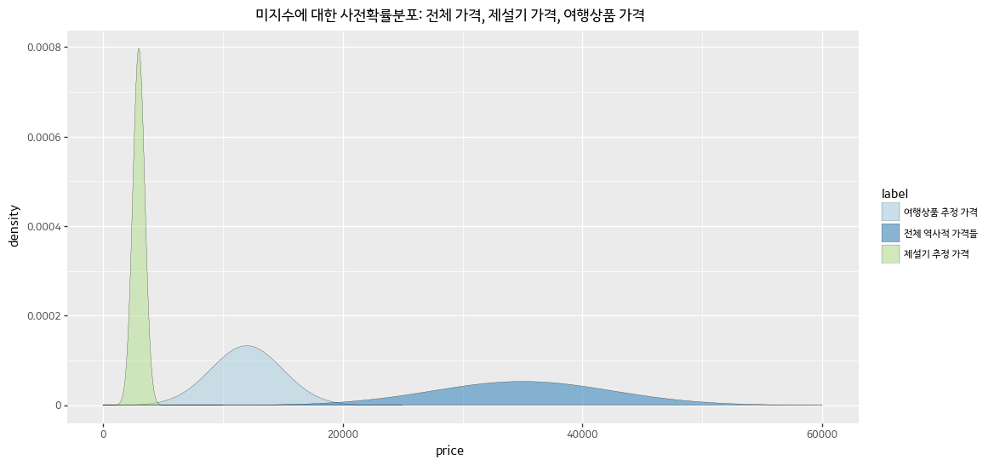
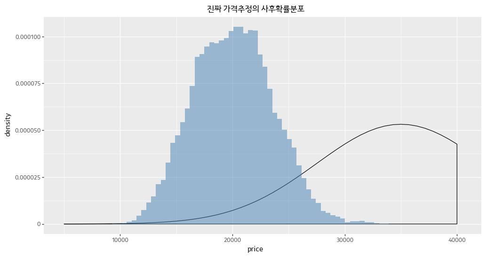

# Ch5. 오히려 더 큰 손해를 보시겠습니까?

## 예제: The Price is Right 쇼케이스 최적화

규칙은 다음과 같다

1. 두 참가자가 쇼케이스에서 겨루게 된다
2. 각 참가자는 각각 다른 구성의 상품을 보게 된다
3. 상품을 관찰한 뒤 참가자는 자신들 앞에 놓인 상품의 가격을 써낸다
4. 써낸 가격이 실제 가격보다 높다면 그 참가자는 탈락한다
5. 써낸 가격이 실제 가격보다 `$250` 이내로 작다면 참가자는 승리하고 상품을 경품으로 받는다

**실제 가격보다 충분히 낮은 금액**을 쓰면서 **최대한 실제 가격과 가까워야 한다**는 점이 이 게임의 어려운 부분이다.

만일 이전 방송을 녹화해두고 보았다면 진짜 가격이 어떤 분포를 따르는지에 대한 생각(사전 믿음)을 가지고 있을 것이다. 여기서는 간단하게 실제 가격이 평균은 35000, 표준편차가 7500인 정규분포를 따른다고 해보자.

```
실제 가격 ~ Normal(mu_p, sigma_p)
(mu_p = 35000, sigma_p = 7500)
```

우리는 각 상품에 대해서도 해당 상품의 가격 분포에 대한 생각을 가지고 있다. 이것 또한 정규분포를 따른다고 가정해보자

```
Prize_i ~ Normal(mu_i, sigma_i)
```

상품 가격은 `Prize_1 + Prize_2 + error` 로 주어진다. 우리는 두 상품을 관찰하고 얻은 결과와 가격에 대한 믿음 분포를 바탕으로 업데이트된 실제 가격을 구하려고 한다.

두 가지 상품을 구체적으로 정해보자

1. `캐나다 토론토 여행 ~ Normal(3000, 500)`
2. `제설기 ~ Normal(12000, 3000)`

사전분포를 시각적으로 확인해보자


```python
from plotnine import *
import scipy.stats as stats
import numpy as np
import pandas as pd

df_historical_price = pd.DataFrame({
    'label': '전체 역사적 가격들',
    'price': np.linspace(0, 60000, 200),
    'density': stats.norm.pdf(np.linspace(0, 60000, 200), 35000, 7500)
})

df_price1 = pd.DataFrame({
    'label': '제설기 추정 가격',
    'price': np.linspace(0, 10000, 200),
    'density': stats.norm.pdf(np.linspace(0, 10000, 200), 3000, 500)
})

df_price2 = pd.DataFrame({
    'label': '여행상품 추정 가격',
    'price': np.linspace(0, 25000, 200),
    'density': stats.norm.pdf(np.linspace(0, 25000, 200), 12000, 3000)
})

df_priors = pd.concat([df_historical_price, df_price1, df_price2])
```


```python
(ggplot(df_priors, aes(x='price', y='density', fill='label')) +
   geom_density(stat='identity', alpha=0.5, size=0.1) +
   scale_fill_brewer(type='qual', palette='Paired') +
   ggtitle('미지수에 대한 사전확률분포: 전체 가격, 제설기 가격, 여행상품 가격') +
   theme_gray(base_family='Kakao') +
   theme(figure_size=(12,6))
)
```





이제 PyMC 코드를 작성해서 상품의 진짜 가격에 대해 추론해보자


```python
import pymc3 as pm

data_mu = [3e3, 12e3]
data_std = [5e2, 3e3]

mu_prior = 35e3
std_prior = 75e2

with pm.Model() as model:
    true_price = pm.Normal('true_price', mu=mu_prior, sd=std_prior)
    
    prize_1 = pm.Normal('first_prize', mu=data_mu[0], sd=data_std[0])
    prize_2 = pm.Normal('second_prize', mu=data_mu[1], sd=data_std[1])
    prize_estimate = prize_1 + prize_2
    
    logp = pm.Normal.dist(mu=prize_estimate, sd=(3e3)).logp(true_price)
    error = pm.Potential('error', logp)
    
    trace = pm.sample(50000, step=pm.Metropolis())
    burned_trace = trace[10000:]
    
price_trace = burned_trace['true_price']
```


```python
df_prize_prior = pd.DataFrame({
    'label': '상품의 사전확률분포',
    'price': np.linspace(5000, 40000),
    'density': stats.norm.pdf(np.linspace(5000, 40000), 35000, 7500)
})

df_price_posterior = pd.DataFrame({
    'label': '진짜 가격추정의 사후확률분포',
    'trace': price_trace
  })

(ggplot(df_prize_prior) +
  geom_density(aes(x='price', y='density'), stat='identity') +
  geom_histogram(data=df_price_posterior, mapping=aes(x='trace', y='..density..'), 
                 alpha=0.5, fill='steelblue') +
  ggtitle('진짜 가격추정의 사후확률분포') +
  theme_gray(base_family='Kakao') +
  theme(figure_size=(12,6))
)
```





두 개의 관찰된 상품과 이후 추론들, 그리고 불확실성까지 고려하여 이전 기록들의 평균 가격보다 약 15,000 달러 낮춰서 예상했다.

- 빈도주의자는 두 상품을 보고, 가격에 대해 동일한 믿음으로 mu1 + mu2 = 35,000 달러를 제시할 것이다.
- 순수베이지안은 여기서 단순히 사후분포의 평균을 고를 것이다. (약 20,000달러)

하지만 우리는 여기에 손실함수를 추가하여 제시할 수 있는 최고의 가격을 구할 것이다.
