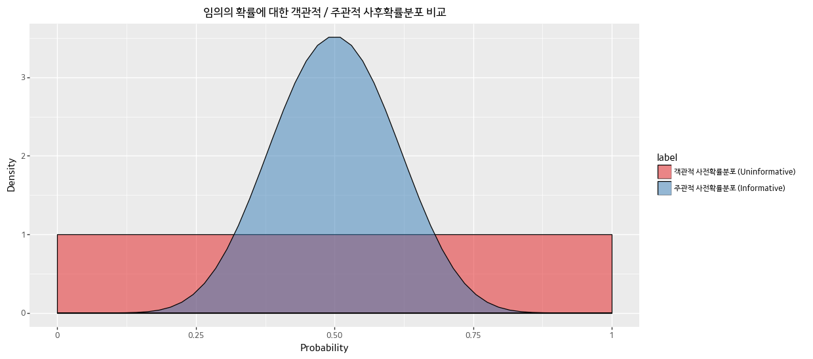
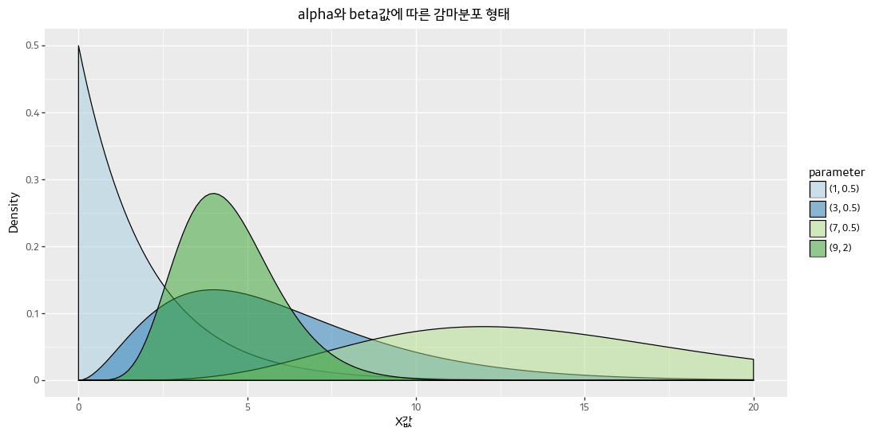
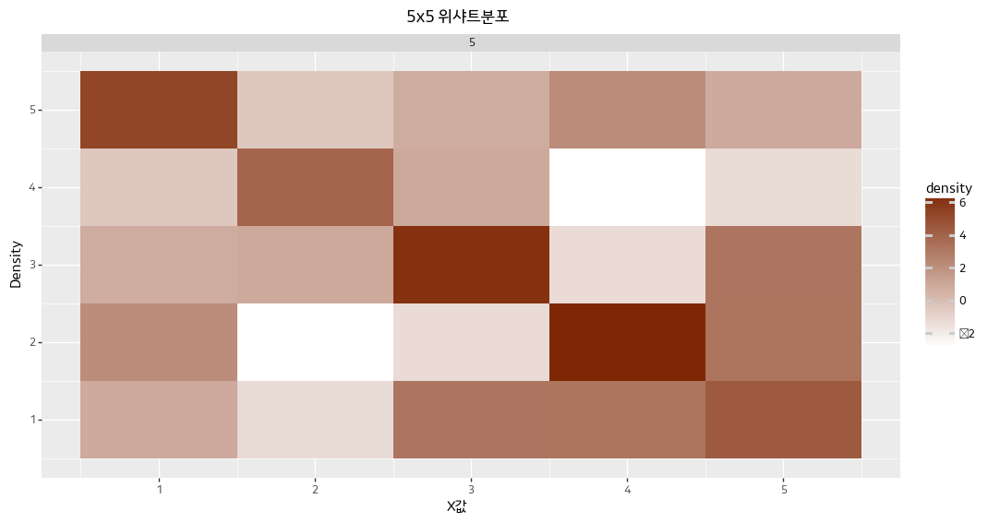
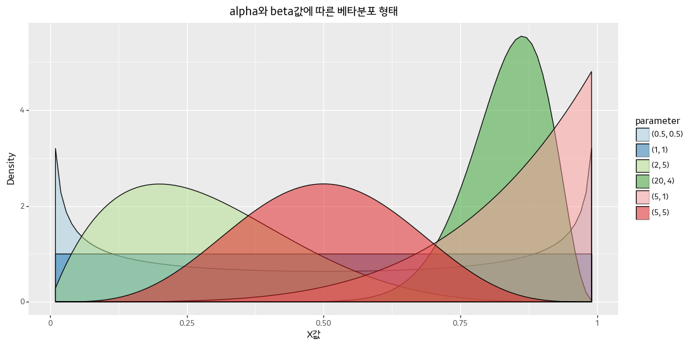

# Ch 6. Getting our prior-ities straight

이 장에서는 **적절한 사전확률분포를 어떻게 고를 것이지**에 대해 다룬다. 

데이터셋이 커질수록 사전확률분포의 영향력이 어떻게 변화하는지 보여주고, 사전확률분포와 선형회귀의 페널티 사이의 관계에 대해서도 살펴본다.

## 주관적 vs 객관적 사전확률분포

베이지안 사전확률분포는 크게 두 가지 분류로 나누어진다

- 객관적인 사전확률분포 (objective priors) : 데이터가 사후확률분포에 최대한 영향을 미치도록 한다
- 주관적인 사전확률분포 (subjective priors) : 실무자가 사전확률분포에 자신의 견해를 반영한다

### 객관적 사전확률분포

평평한 사전확률분포 (flat prior) 는 객관적 사전확률분포의 일종이라고 볼 수 있다. 미지수가 가질 수 있는 전체 구간에 대해 균등분포를 가정한다. 다시 말해서, 모든 가능한 값에 동일한 비중을 부여한다. 이러한 사전확률분포를 선택하는 것은, 어떤 값을 특별히 더 선호할 이유가 없다는 **무차별성의 원리**에 따르는 것이다.

### 주관적 사전확률분포

사전확률분포의 특정 영역에 확률 질량 (probability mass) 를 더 추가한다면, 특정 영역에 존재하는 모수에 편향된 추론을 하게 된다. 이것을 주관적 사전확률 분포라고 한다. (subjective / informative prior)


```python
from plotnine import *
import pandas as pd
import numpy as np
import scipy.stats as stats

df_uninformative = pd.DataFrame({
    'label': '객관적 사전확률분포 (Uninformative)',
    'x': np.linspace(0, 1),
    'value': stats.beta.pdf(np.linspace(0, 1), 1, 1)
})

df_informative = pd.DataFrame({
    'label': '주관적 사전확률분포 (Informative)',
    'x': np.linspace(0, 1),
    'value': stats.beta.pdf(np.linspace(0, 1), 10, 10)
})

df_obj_sub = pd.concat([df_uninformative, df_informative])
```


```python
(ggplot(df_obj_sub, aes(x='x', y='value', fill='label')) +
 geom_density(stat='identity', alpha = 0.5) +
 scale_fill_brewer(type='qual', palette='Set1') +
 xlab('Probability') + ylab('Density') + 
 ggtitle('임의의 확률에 대한 객관적 / 주관적 사후확률분포 비교') +
 theme_gray(base_family='Kakao') +
 theme(figure_size=(12,6))
)
```





주관적 사후확률분포를 선택하는 것이 항상 실무자의 주관적인 의견을 사용한다는 것은 아니다. 주관적인 사전확률분포는 이전 문제의 사후확률분포라고 볼 수도 있다. 또한 도메인 지식을 문제에 반영하는데 사용되기도 한다.

### 결정

보통 해결하려는 문제에 따라 객관적 / 주관적 사전확률분포를 선택한다. 하지만 특정 사전확률분포가 더 선호되는 경우가 몇 가지 있는데, 과학 연구의 경우 결과에 대한 편향을 제거하기 위해 객관적인 사전확률분포를 선택하게 된다.

사전확률분포를 선택하는 일은 모델링 과정의 일부라는 것을 명심해야 한다. 사후확률분포에서 무언가 이상한 점을 느꼈다면, 현재의 사전확률분포에 더 필요한 정보가 있다는 것을 의미한다. 따라서 사전확률분포를 업데이트 해야 한다.

객관적 사전확률분포를 선택할 때, 범위가 큰 균등분포를 사용하는 것은 보통 좋은 선택이다. 다만 이 경우 사전확률분포의 상당 부분이 직관적이지 않은 위치에 배치될 수 있다. 수치 변수의 경우 자연스럽게 0으로 편향되는 경우가 많다. 그렇다면 분산이 큰 정규분포나 두꺼운 꼬리를 가진 지수분포 (양수 / 음수만 존재할 경우) 를 선택하는 것이 나을 수 있다.

### 경험적 베이즈 (Empirical Bayes)

경험적 베이즈는 빈도주의자와 베이지안 추론을 결합한 트릭이다. 경험적 베이즈에서는 빈도주의 방법으로 사전확률분포의 파라미터를 선택하고, 원래의 문제는 베이지안 방법으로 처리한다.

sd = 5인 정규분포의 모수 mu를 추정한다고 해보자. mu는 실수 범위를 가지기 때문에 사전확률분포로 정규분포를 선택할 수 있다. 이 때 사전확률분포의 파라미터를 (`mu_p`, `sigma_p`) 선택해야한다. `sigma_p`의 경우 우리가 가진 불확실성을 반영해서 결정하면 된다. `mu_p` 에 대해서는 다음 두 가지 중 하나를 선택할 수 있다.

- **경험적 베이즈** : 표본 평균을 사용한다
- **전통적 베이즈** : 사전 지식 또는 객관적 사전확률분포를 사용한다

경험적 베이즈 방법론은 데이터를 중복해서 계산한다는 의견도 있다. 데이터를 사전확률분포에서 한 번 사용하고, MCMC 추론과정에서 다시 사용한다. 이렇게 이중으로 계산을 하게 되면 실제 불확실성을 과소평가하게 될 우려가 있다. 

```
경험적 베이즈 : 관측 데이터 -> 사전확률 -> 관측 데이터 -> 사후확률
전통적 베이즈 : 사전확률 -> 관측 데이터 -> 사후확률
```

## 알아두면 유용한 사전확률분포

베이지안 분석 방법론에서 공통적으로 사용되는 분포들에 대해 알아보자.

### 감마분포 (Gamma Distribution)

감마확률변수(`X ~ Gamma(alpha, beta)`)는 양의 실수에 대한 확률변수다. 이것은 사실 지수확률변수의 일반형이다.

```
Exp(beta) ~ Gamma(1, beta)
```

(alpha, beta)의 여러 값에 대한 감마분포는 다음과 같다.


```python
parameters = [(1, 0.5), (9, 2), (3, 0.5), (7, 0.5)]
x = np.linspace(0.001, 20, 150)
temp_density = []

for alpha, beta in parameters:
    y = stats.gamma.pdf(x, alpha, scale=1/beta)
    _density = pd.DataFrame({
        'parameter': '({0}, {1})'.format(alpha, beta), 
        'x': x, 
        'y': y
    })
    temp_density.append(_density)
    
df_density = pd.concat(temp_density)
```


```python
(ggplot(df_density, aes(x='x', y='y', fill='parameter')) +
  geom_density(stat='identity', alpha=0.5) +
  scale_fill_brewer(type='qual', palette='Paired') +
  xlab('X값') + ylab('Density') + 
  ggtitle('alpha와 beta값에 따른 감마분포 형태') +
  theme_gray(base_family='Kakao') +
  theme(figure_size=(12,6))
)
```





### 위샤트분포 (Wishart distribution)

지금까지 우리는 스칼라인 확률변수만 다루었다. 물론 행렬도 다룰 수 있다. **위샤트분포**는 Positive semi-definite 행렬에 대한 분포다. 이게 왜 필요할까? 공분산 행렬이 positive-definite 행렬이기 때문에, 위샤트분포는 공분산행렬에 대한 사전확률분포로 적합하다. 


```python
def wishart(n):
    df_density = pd.DataFrame({
        'n': n,
        'x': list(range(1, n+1))*n,
        'y': sorted(list(range(1, n+1))*n, reverse=True),
        'density': stats.wishart.rvs(n+1, np.eye(n)).reshape(n**2)
    })
    
    return df_density
```


```python
df_wishart = wishart(5)
```


```python
(ggplot(df_wishart, aes(x='x', y='y', fill='density')) +
  geom_tile(stat='identity') +
  facet_wrap('~ n', scales='free') + 
  scale_fill_gradient(low='#ffffff', high='#7f2704') +
  xlab('X값') + ylab('Density') + 
  ggtitle('5x5 위샤트분포') +
  theme_gray(base_family='Kakao') +
  theme(figure_size=(12,6))
)
```





### 베타분포

베타분포는 확률변수를 0~1 사이의 값으로 정의한다. 따라서 소수, 확률, 비율을 모델링하기 위한 분포로 많이 사용한다. 모수가 (alpha, beta)인 베타분포에서 alpha, beta값 모두 양수이고, 두 파라미터를 통해 다양한 형태를 구성할 수 있다.


```python
parameters = [(2, 5), (1, 1), (0.5, 0.5), (5, 5), (20, 4), (5, 1)]
x = np.linspace(0.01, 0.99, 100)
temp_density = []

for a, b in parameters:
    y = stats.beta.pdf(x, a, b)
    
    _density = pd.DataFrame({
        'parameter': '({0}, {1})'.format(a, b), 
        'x': x, 
        'y': y
    })
    temp_density.append(_density)

df_density_beta = pd.concat(temp_density)
```


```python
(ggplot(df_density_beta, aes(x='x', y='y', fill='parameter')) +
  geom_density(stat='identity', alpha=0.5) +
  scale_fill_brewer(type='qual', palette='Paired') +
  xlab('X값') + ylab('Density') + 
  ggtitle('alpha와 beta값에 따른 베타분포 형태ㅠ') +
  theme_gray(base_family='Kakao') +
  theme(figure_size=(12,6))
)
```





Beta(1, 1)은 균등분포다. 베타분포는 균등분포를 일반화한 결과라고 생각할 수 있다.

베타분포와 이항분포 사이에는 흥미로운 관계가 존재한다. 이항분포를 따르는 관측치를 가진 베타사전분포는 베타사후분포를 갖는다. 구체적으로 살펴보자면, 미지의 확률 p에 대해 `Beta(1, 1)` 사전분포를 적용하고 데이터는 `X ~ Binomial(N, p)`를 관측할 경우, 우리의 사후확률은 `Beta(1+X, 1+N-X)`가 된다. 
