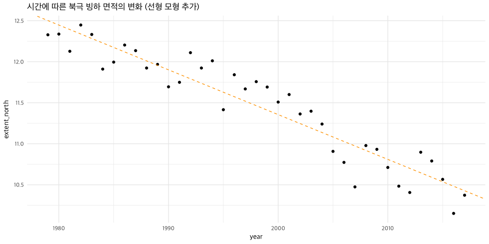

# Intro to Stan

다음 포스팅을 요약해서 정리해보자
<https://ourcodingclub.github.io/2018/04/17/stan-intro.html>

## 1. Learn about Stan

베이지안 모델링같은 통계적 모형들은 문제에 적합한 모형을 구성하고 그 모형이 우리의 데이터에 맞도록 개선하는 과정을 요구한다. 모형을 구성하는 과정과 베이지안 통계에 대한 기본적인 배경지식은 다음 포스팅을 통해 확인할 수 있다.

- <https://ourcodingclub.github.io/2018/04/06/model-design.html>
- <https://ourcodingclub.github.io/2018/01/22/mcmcglmm.html>

통계적 모형은 R이나 다른 언어들을 통해 구성할 수 있다. 하지만 가끔씩 구상하던 모형을 구현하는 것이 패키지나 언어 차원의 제약으로 인해 어려워지는 경우가 있다. 이런 경우가 생기면 `stan` 같은 통계적 프로그래밍 언어를 찾게 된다.

우선 이번 튜토리얼에서는 **stan**을 통해 간단한 선형 모형을 구성해보자. 그리고 점차 더 복잡한 모형을 구성하는 방향으로 진행해보자.

베이지안 모형은 다음과 같은 순서로 구성해 볼 수 있다.

1. 모형을 구성한다
2. Prior를 고른다
    - Informative prior를 쓸 것인가?
    - prior로 변환할 수 있는 외부 데이터가 존재하는가?
3. Posterior 분포의 샘플을 구한다
4. 모형이 잘 수렴되었는지 확인한다
5. Posterior를 통해 모형을 평가하고 데이터와 비교해본다
6. 위 과정을 반복한다

## 2. 데이터

```{r}
library('tidyverse')
```

```{r}
knitr::opts_chunk$set(fig.width = 14, fig.height = 7)
```

### 2.1 데이터 불러오기

```{r}
url_seaice = 'https://raw.githubusercontent.com/ourcodingclub/CC-Stan-intro/master/seaice.csv'
seaice = read_csv(url_seaice)
```

### 2.2 연구하려는 질문: 북극의 빙하 면적이 시간에 따라 감소하고 있는가?

문제에 대한 답변을 위해 그래프를 그려서 한 번 확인해보자

```{r}
ggplot(seaice, aes(x = year, y = extent_north)) +
  geom_point() +
  ggtitle('시간에 따른 북극 빙하 면적의 변화') +
  theme_minimal(base_family = 'Apple SD Gothic Neo')
```


`lm` 함수를 통해 일반적인 선형 모형을 구성해보자.

```{r}
lm1 = lm(extent_north ~ year, data = seaice)
summary(lm1)
```

```{r}
ggplot(seaice, aes(x = year, y = extent_north)) +
  geom_point() +
  geom_abline(slope = lm1$coefficients[2], intercept = lm1$coefficients[1],
              color = 'orange', linetype = 2) +
  ggtitle('시간에 따른 북극 빙하 면적의 변화 (선형 모형 추가)') +
  theme_minimal(base_family = 'Apple SD Gothic Neo')
```



선형 모형의 공식은 다음과 같다

```
Y = alpha + beta*X + error
```

**Stan**에서는 구성하려는 모형의 공식을 명시해야 하기 때문에, 모형의 공식에 대해서 생각해보는 것이 중요하다.