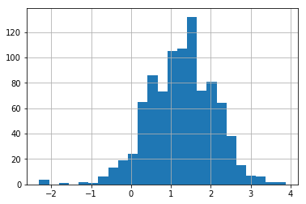

# PyStan을 이용한 베이지안 다층모형

다음 문서를 정리한다. <http://mc-stan.org/users/documentation/case-studies/radon.html>

위계모형, 다층모형 등은 회귀모형을 일반화시킨 결과물이다. 

**다층모형 (Multilevel Model)** 은 모형의 파라미터에 확률 모형이 반영된 회귀모형을 말한다. 이것은 파라미터가 그룹별로 달라진다는 것을 의미한다. 관측한 데이터들은 자연스럽게 클러스터를 이루는 경우가 있다. 이러한 클러스터로 인해 아무리 샘플링을 잘 했다고 하더라도 데이터 사이에 의존성이 생기게 된다.

**위계모형 (Hierarchical Model)** 은 특정 파라미터 안에 다른 파라미터가 중첩되어 있는 다층모형의 특수한 경우를 말한다.

# Radon Contamination 예제

라돈 수치는 가구마다 다르다. 80,000 가구의 라돈 수치를 조사했다. 중요한 두 가지 변수는 다음과 같다.

- 지하실 / 1층의 수치 (보통 지하실의 라돈 수치가 높다)
- 카운티의 우라늄 수치 (라돈 수치와 상관관계가 있다)

미네소타 주의 라돈 수치를 중심으로 살펴보자. 이 예제에서 hierarchy는 카운티 내의 가구들이다


```python
import pystan
import pandas as pd
import numpy as np
from plotnine import *

%matplotlib inline
```


```python
url_srrs = 'https://raw.githubusercontent.com/pymc-devs/pymc3/master/pymc3/examples/data/srrs2.dat'
url_cty = 'https://github.com/pymc-devs/pymc3/raw/master/pymc3/examples/data/cty.dat'
```


```python
srrs = pd.read_csv(url_srrs)
cty = pd.read_csv(url_cty)
```


```python
srrs_mn = (srrs
    .loc[lambda d: d.state=='MN']
    .rename(columns={'activity': 'radon'})
    .assign(fips = lambda d: d.stfips*1000 + d.cntyfips,
            log_radon = lambda d: np.log(d.radon + 0.1))
)
```


```python
cty_mn = (cty
    .loc[lambda d: d.st == 'MN']
    .assign(fips = lambda d: d.stfips*1000 + d.ctfips)
    .loc[:, ['fips', 'Uppm']]
)
```


```python
radon_mn = srrs_mn.merge(cty_mn, on='fips')
```


```python
radon_mn.loc[:,'log_radon'].hist(bins=25)
```


