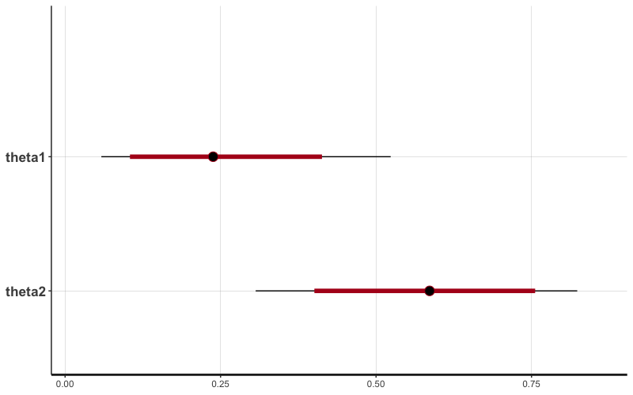
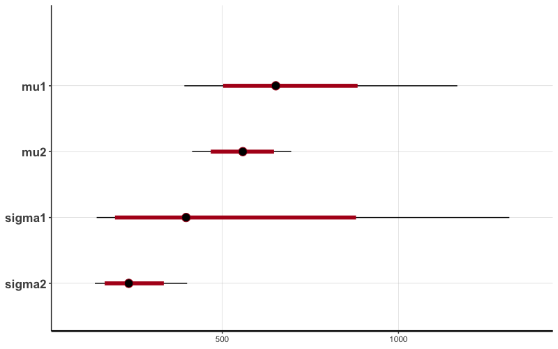

# Beginners Exercise: Bayesian computation with Stan

데이터 분석과 관련된 몇 가지 문제가 있습니다. R과 Stan을 사용하여 문제를 해결하기 위한 모형을 작성하세요.

원본 문제는 [다음 링크](http://www.sumsar.net/files/posts/2017-01-15-bayesian-computation-with-stan-and-farmer-jons/stan_exercise.html)에 있습니다.

# 1. 시작하기

```r
library(tidyverse)
library(rstan)

# To avoid recompilation of unchanged Stan programs
rstan_options(auto_write = TRUE)
```

Question : **코드를 잘 살펴보고, 아래의 코드가 잘 동작하는지 확인해보세요.**

```r
# The Stan model as a string.
model_string = "
data {
  // Number of data points
  int n1;
  int n2;
  // Number of successes
  int y1[n1];
  int y2[n2];
}

parameters {
  // A 'rate' has to be between 0 and 1 => <lower=0, upper=1>
  real<lower=0, upper=1> theta1;
  real<lower=0, upper=1> theta2;
}

model {  
  theta1 ~ beta(1, 1);
  theta2 ~ beta(1, 1);
  y1 ~ bernoulli(theta1);
  y2 ~ bernoulli(theta2);
}

generated quantities {
}
"

y1 = c(0, 1, 0, 0, 0, 0, 1, 0, 0, 0)
y2 = c(0, 0, 1, 1, 1, 0, 1, 1, 1, 0)
data_list = list(y1 = y1, y2 = y2, n1 = length(y1), n2 = length(y2))

# Compiling and producing posterior samples from the model.
stan_samples = stan(model_code = model_string, data = data_list)
```

**Answer**

- 모형에 대한 설명
    - `y1`, `y2` 변수는 베르누이 분포를 따르고, 각각의 파라미터는 (비율, 또는 성공확률을 의미한다) `theta1`, `theta2` 를 따른다
    - `theta1`, `theta2` 는 `Beta(1,1)` 분포를 따른다
    - `theta1`, `theta2` 는 비율을 나타내는 값이기 때문에 0과 1사이에 존재한다
- 학습결과
    - `theta1`의 평균은 0.25 이고, 95% 신뢰구간은 [0.06, 0.52] 이다
    - `theta2`의 평균은 0.58 이고, 95% 신뢰구간은 [0.31, 0.82] 이다

```r
# summarizing the posterior distribution
stan_samples

# Inference for Stan model: 44b4fe5b1a77520188e78f1edb27b9a4.
# 4 chains, each with iter=2000; warmup=1000; thin=1;
# post-warmup draws per chain=1000, total post-warmup draws=4000.
#
#          mean se_mean   sd   2.5%    25%    50%    75%  97.5% n_eff Rhat
# theta1   0.25    0.00 0.12   0.06   0.16   0.24   0.32   0.52  3044    1
# theta2   0.58    0.00 0.14   0.31   0.49   0.59   0.68   0.82  3197    1
# lp__   -15.94    0.03 1.04 -18.78 -16.35 -15.61 -15.19 -14.92  1633    1
#
# Samples were drawn using NUTS(diag_e) at Wed Apr 10 19:16:24 2019.
# For each parameter, n_eff is a crude measure of effective sample size,
# and Rhat is the potential scale reduction factor on split chains (at
# convergence, Rhat=1).
```

```r
plot(stan_samples)
# ci_level: 0.8 (80% intervals)
# outer_level: 0.95 (95% intervals)
```



# 2. 샘플링 결과 다루기

파라미터 각각에 대한 샘플링 결과를 살펴보고 싶다면, stan object를 데이터 프레임으로 변환하여 보는 것이 편리하다.
변환하면 각각의 파라미터를 컬럼별로 확인할 수 있다.

```r
df_samples = stan_samples %>%
  extract() %>%
  as_tibble()

# # A tibble: 4,000 x 3
#    theta1 theta2  lp__
#     <dbl>  <dbl> <dbl>
#  1 0.160   0.720 -15.7
#  2 0.253   0.764 -15.9
#  3 0.360   0.574 -15.2
#  4 0.194   0.263 -17.7
#  5 0.312   0.589 -15.0
#  6 0.214   0.489 -15.2
#  7 0.205   0.759 -15.9
#  8 0.490   0.477 -16.6
#  9 0.0288  0.627 -19.1
# 10 0.351   0.652 -15.3
# # ... with 3,990 more rows
```

Question : **y1, y2 두 항목의 실제 비율 차이가 0.2보다 작을 확률을 구해보세요**

Answer

- 0.2325
- 샘플링 결과에서 `abs(theta1 - theta2)` 를 계산하고, 이 값이 0.2보다 작은 비율을 구한다

```r
# 구해야 하는 확률은 아래 그래프에서 색칠된 구간에 해당된다
ggplot(df_samples, aes(x = abs(theta1 - theta2))) +
  geom_density() +
  geom_area(aes(y = if_else(stat(x) <= 0.2, stat(density), 0)),
            stat = 'density', fill = '#FA7268') +
  geom_vline(xintercept = 0.2, color = 'red', linetype = 2) +
  xlab('abs(Rate of y1 - Rate of y2)') +
  ggtitle('Density of the difference between the two underlying rates') +
  theme_minimal(base_family = 'Helvetica Light')
```


```r
# 두 비율의 차이가 0.2보다 작을 확률을 계산한다
df_samples %>%
  mutate(diff = abs(theta1 - theta2)) %>%
  summarise(p = mean(diff < 0.2)) %>%
  pull(p)
# [1] 0.2325
```

# 3. 효과 좋은 약 찾기

농부 김씨는 많은 수의 소를 키우고 있습니다.
이 중에서 10마리의 소에게 A약을 주고, 10마리의 소에게는 B약을 주었습니다.
그리고 여름동안 소가 병에 걸리는지 (0) 아니면 건강한지(1) 측정했습니다.

그 결과는 다음과 같았습니다.

```{r}
cowA = c(0, 1, 0, 0, 0, 0, 1, 0, 0, 0)
cowB = c(0, 0, 1, 1, 1, 0, 1, 1, 1, 0)
```

Question : **약이 얼마나 효과적이었을까요? A약이 B보다 낫거나 별로였다면 그 근거는 무엇인가요?**

```{r}
data_list_q3 = list(y1 = cowA, y2 = cowB, n1 = length(cowA), n2 = length(cowB))
stan_samples_q3 = stan(model_code = model_string, data = data_list_q3)
```

Answer

- A약이 더 나을 확률은 `0.0425` 로 계산되었다
- 또한 `A약의 효과 - B약의 효과` 의 90% 신용구간은 `[-0.628, -0.0126]` 이다
- 따라서 B약이 더 나을 것으로 보인다

```r
stan_samples_q3
# Inference for Stan model: 44b4fe5b1a77520188e78f1edb27b9a4.
# 4 chains, each with iter=2000; warmup=1000; thin=1;
# post-warmup draws per chain=1000, total post-warmup draws=4000.
#
#          mean se_mean   sd   2.5%    25%    50%    75%  97.5% n_eff Rhat
# theta1   0.25    0.00 0.12   0.06   0.16   0.24   0.33   0.53  3206    1
# theta2   0.59    0.00 0.14   0.30   0.49   0.59   0.69   0.84  3237    1
# lp__   -15.98    0.03 1.09 -18.84 -16.40 -15.66 -15.20 -14.92  1687    1
#
# Samples were drawn using NUTS(diag_e) at Thu Apr 11 17:44:21 2019.
# For each parameter, n_eff is a crude measure of effective sample size,
# and Rhat is the potential scale reduction factor on split chains (at
# convergence, Rhat=1).

df_samples_q3 = stan_samples_q3 %>%
  extract() %>%
  as_tibble()

# A약이 더 나을 확률
p_is_a_better = df_samples_q3 %>%
  mutate(is_a_better = theta1 > theta2) %>%
  summarise(result = mean(is_a_better)) %>%
  pull(result)
# [1] 0.0425

# B약이 더 나을 확률
p_is_b_better = df_samples_q3 %>%
  mutate(is_b_better = theta1 < theta2) %>%
  summarise(result = mean(is_b_better)) %>%
  pull(result)
# [1] 0.9575

# 90% Credible Interval 계산
df_samples_q3 %>%
  mutate(diff_effect = theta1 - theta2) %>%
  summarise(diff_effect_q05 = quantile(diff_effect, 0.05),
            diff_effect_q95 = quantile(diff_effect, 0.95))
#   diff_effect_q05 diff_effect_q95
#             <dbl>           <dbl>
# 1          -0.628         -0.0126
```

# 4. 특별 식단의 효과 측정하기

농부 김씨는 많은 수의 소를 키우고 있습니다.
김씨는 최근 식단 조절로 소들의 우유 생산량이 크게 증가했다는 소문을 들었습니다.
그래서 일부 소에게 특별 식단을 주고, 우유 생산량이 증가하는지 측정했습니다.

특별 식단을 준 10마리의 소와 일반 식단을 준 15마리의 소에게서 한 달간 측정한 결과,
다음과 같은 데이터를 얻을 수 있었습니다.

```r
diet_milk = c(651, 679, 374, 601, 401, 609, 767, 709, 704, 679)
normal_milk = c(798, 1139, 529, 609, 553, 743, 151, 544, 488, 555, 257, 692, 678, 675, 538)
```

Question : **식단 변경이 정말 효과가 있었을까요? 특별식단을 먹은 소의 우유 생산량이 증가했나요?**

- Hint
    - 정규분포 (`normal` 함수를 사용합니다) 를 사용해보세요
    - `mu` 와 `sigma` 변수에 다양한 prior를 적용해볼 수 있습니다 (특정한 분포를 지정하지 않으면 `uniform` 분포가 적용됩니다)

```r
model_string_q4 = "
data {
  // Number of data points
  int n1;
  int n2;
  // Number of liters of milk
  real<lower=0> y1[n1];
  real<lower=0> y2[n2];
}

parameters {
  // Priors for Normal Distribution
  real mu1;
  real mu2;
  real sigma1;
  real sigma2;
}

model {
  // Distribution of milk produce
  y1 ~ normal(mu1, sigma1);
  y2 ~ normal(mu2, sigma2);
}

generated quantities {
}
"

data_list_q4 = list(y1 = diet_milk, y2 = normal_milk, n1 = length(diet_milk), n2 = length(normal_milk))

# Compiling and producing posterior samples from the model.
stan_samples_q4 = stan(model_code = model_string_q4, data = data_list_q4, seed = 123)
```

```r
stan_samples_q4
# Inference for Stan model: a3ccfe7990b06f6c68f42a0fcfd64f4c.
# 4 chains, each with iter=2000; warmup=1000; thin=1;
# post-warmup draws per chain=1000, total post-warmup draws=4000.
#
#           mean se_mean    sd    2.5%     25%     50%     75%   97.5% n_eff Rhat
# mu1     618.19    1.03 52.51  517.53  585.67  617.80  650.66  726.47  2614    1
# mu2     599.54    1.31 65.43  470.08  558.14  598.28  640.69  730.65  2479    1
# sigma1  154.22    1.27 46.40   94.28  122.28  145.44  173.98  275.95  1339    1
# sigma2  250.13    1.13 52.78  170.43  213.18  241.69  279.05  378.19  2191    1
# lp__   -144.00    0.05  1.69 -148.24 -144.83 -143.63 -142.76 -141.82  1031    1
#
# Samples were drawn using NUTS(diag_e) at Fri Apr 12 01:51:42 2019.
# For each parameter, n_eff is a crude measure of effective sample size,
# and Rhat is the potential scale reduction factor on split chains (at
# convergence, Rhat=1).
```

```r
plot(stan_samples_q4)
```


Answer

- 특별 식단이 우유 생산량을 증가시켰을 확률은 `0.61725` 이다
- 특별 식단과 일반 식단의 차이에 대해서 90% 신용구간을 구해보면 `[-118, +155]` 이다
- 따라서 **현재 데이터로는 특별 식단으로 인해 우유 생산량이 증가했다고 보기 어렵다**

```r
df_samples_q4 = stan_samples_q4 %>%
  extract() %>%
  as_tibble()

# mu1 > mu2 일 확률
df_samples_q4 %>%
  mutate(is_diet_effective = mu1 > mu2) %>%
  summarise(is_diet_effective = mean(is_diet_effective)) %>%
  pull(is_diet_effective)
# [1] 0.61725

df_samples_q4 %>%
  mutate(diff_effect = mu1 - mu2) %>%
  summarise(diff_q05 = quantile(diff_effect, 0.05),
            diff_q95 = quantile(diff_effect, 0.95))
#   diff_q05 diff_q95
#      <dbl>    <dbl>
# 1    -118.     155.
```

# 5. 돌연변이 소로 인한 효과 제거하기

농부 김씨는 많은 수의 소를 키우고 있습니다.
최근 농장 주변의 발전소에서 방사능 누출 사고가 발생하여 일부 소에서 돌연변이가 발생했다고 합니다.
김씨는 **특별 식단의 효과를 측정하되, 돌연변이가 아닌 소에 대해서만 효과를 측정**하고 싶어합니다.
(돌연변이 소는 엄청난 양의 우유를 만들어내거나, 아니면 아예 우유가 나오지 않기도 합니다)

다음 데이터는 특별 식단을 먹은 소와 일반 식단을 먹은 소의 우유 생산량을 비교한 자료입니다.

```r
diet_milk = c(651, 679, 374, 601, 4000, 401, 609, 767, 3890, 704, 679)
normal_milk = c(798, 1139, 529, 609, 553, 743, 3,151, 544, 488, 15, 257, 692, 678, 675, 538)
```

일부 자료는 돌연변이 소에서 나온 자료일 수 있습니다. (**아웃라이어**라고 볼 수 있습니다)

Question : **특별 식단이 정말 효과가 있었나요? 돌연변이가 생기지 않은 소에서 우유 생산량이 증가했나요?**

- Hint
    - 아웃라이어 문제에 대한 전통적인 접근 방식은 정규분포 대신 꼬리가 더 넓은 분포를 사용하는 것입니다
    - 이러한 특성을 가진 분포 중에서 t 분포를 많이 사용합니다
        - t분포의 세 번째 파라미터인 **자유도(degrees of freedom)** 를 낮추면, 꼬리가 더 넓어집니다
        - t분포의 자유도가 50보다 크면 정규분포와 거의 같아진다고 합니다
    - 이 문제에서는 자유도가 3정도인 t분포를 사용하는 것이 도움이 될 것 같습니다
        - `y ~ student_t(3, mu, sigma);`
        - 물론 자유도마저 변수로 둘 수 있겠지만 이 문제에서는 너무 과할 수 있습니다

```r
model_string_q5 = "
data {
  // Number of data points
  int n1;
  int n2;
  // Number of liters of milk
  real<lower=0> y1[n1];
  real<lower=0> y2[n2];
}

parameters {
  // Priors for student-t Distribution
  real<lower=0> mu1;
  real<lower=0> mu2;
  real<lower=0> sigma1;
  real<lower=0> sigma2;
}

model {
  // Distribution of milk produce
  y1 ~ student_t(3, mu1, sigma1);
  y2 ~ student_t(3, mu2, sigma2);
}

generated quantities {
}
"

data_list_q5 = list(y1 = diet_milk, y2 = normal_milk, n1 = length(diet_milk), n2 = length(normal_milk))

# Compiling and producing posterior samples from the model.
stan_samples_q5 = stan(model_code = model_string_q5, data = data_list_q5, seed = 123)
```

```r
stan_samples_q5
# Inference for Stan model: 50fc028711a4bafbbb8757af3e465b6e.
# 4 chains, each with iter=2000; warmup=1000; thin=1;
# post-warmup draws per chain=1000, total post-warmup draws=4000.
#
#           mean se_mean     sd    2.5%     25%     50%     75%   97.5% n_eff Rhat
# mu1     681.97    4.93 193.03  392.48  580.34  651.82  745.62 1166.36  1534    1
# mu2     558.08    1.30  71.49  414.38  510.98  558.30  606.18  695.57  3036    1
# sigma1  483.72    7.84 311.76  143.70  273.14  397.10  598.71 1314.01  1579    1
# sigma2  244.04    1.32  67.00  138.62  195.04  234.89  283.96  400.12  2580    1
# lp__   -154.49    0.04   1.48 -158.20 -155.25 -154.18 -153.39 -152.55  1362    1
#
# Samples were drawn using NUTS(diag_e) at Mon Apr 15 18:38:20 2019.
# For each parameter, n_eff is a crude measure of effective sample size,
# and Rhat is the potential scale reduction factor on split chains (at
# convergence, Rhat=1).
```

```r
plot(stan_samples_q5)
```



Answer

- 특별 식단이 우유 생산량을 증가시켰을 확률은 `0.7555` 이다
- 특별 식단과 일반 식단의 차이에 대해서 90% 신용구간을 구해보면 `[-141, +481]` 이다
- 따라서 이전 모델과 비교했을 때는 차이가 더 나지만, **특별 식단으로 인해 우유 생산량이 증가했다고 보기에는 여전히 증거가 부족하다**

```r
df_samples_q5 = stan_samples_q5 %>%
  extract() %>%
  as_tibble()

df_samples_q5 %>%
  mutate(is_diet_effective = mu1 > mu2) %>%
  summarise(is_diet_effective = mean(is_diet_effective)) %>%
  pull(is_diet_effective)
# [1] 0.7555

df_samples_q5 %>%
  mutate(diff_effect = mu1 - mu2) %>%
  summarise(diff_q05 = quantile(diff_effect, 0.05),
            diff_q95 = quantile(diff_effect, 0.95))
# # A tibble: 1 x 2
#   diff_q05 diff_q95
#      <dbl>    <dbl>
# 1    -141.     481.
```
