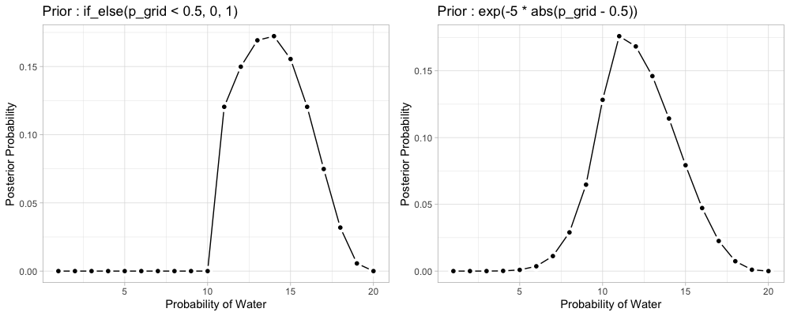
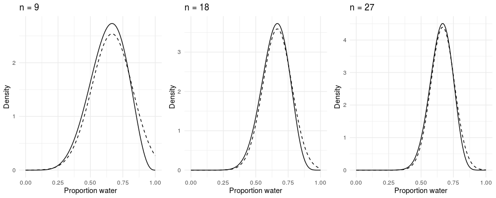

# 2. Small Worlds and Large Worlds

콜럼버스는 세상이 (지금 현재 우리가 생각하는 것보다) 작을 것이라는 예측을 바탕으로 세계 일주에 나섰다. 세상은 훨씬 넓었기 때문에 콜럼버스의 예상은 틀렸지만, 운이 좋게도 새로운 대륙을 발견하게 되었다. 

콜럼버스가 생각했던 작은 세상과 실제 넓은 세상은 **모형과 현실의 차이**와 비슷하다.

- Small Worlds
    - 논리적으로 구성된 모형 내의 세계
    - 가능한 모든 경우의 수를 고려할 수 있다
    - 모형이 예상했던 대로 동작하는지 검증할 수 있다
- Large Worlds
    - 모형이 적용되는 더 넓은 맥락에서의 세계
    - 생각하지 못했던 일이 일어날 수도 있다

# 2.1 The garden of forking data

호르헤 루이스 보르헤스의 책 "갈림길의 정원" 은 모순으로 가득한 책을 접하게 된 사람에 대한 이야기다. 책에서 등장 인물은 특정 지점에 도달하면 가능한 경로 중에서 하나를 선택해야 한다. 주인공이 어떤 사람의 집에 도착했을 때, 그 사람을 죽일 수도 있고 차를 한 잔 마실 수도 있다. 살인과 차 중에서 하나만 선택할 수 있다. 하지만 보르헤스의 책에서는 각각의 결정이 다른 분기점으로 연결되어 결국 모든 경로를 탐색하게 된다. 

베이지안 추론에서도 같은 방식을 사용한다. 좋은 추론을 하기 위해서는 가능한 모든 경우의 수를 고려해야 한다. 베이지안 추론은 데이터 버전의 갈림길의 정원이라고 볼 수 있다. 발생할 수 있는 데이터 시퀀스를 만들어 내고 나면, 실제로 어떤 일들이 일어났는지를 통해 가능한 시퀀스 중 일부를 제거할 수 있다. 

이러한 접근 방법은 가정과 데이터가 주어졌을 때, 가설의 정량적인 순위를 매길 수 있게 해준다. 모형을 통해 구성된 작은 세상에서 가능한 가장 좋은 방법을 찾을 수 있다. 

# 2.2 Building a model

한 손으로 잡을 수 있는 지구본이 있다고 생각해보자. 지구의 표면이 얼마나 물로 뒤덮여있는지 알고 싶다면 어떻게 해야 할까? 지구본을 던져서 잡았을 때 오른손 검지가 어디를 짚고 있는지 반복해서 기록해보자. 바다라면 W, 육지라면 L라고 기록했을 때 처음 9번의 실험에서 다음과 같은 결과를 얻었다.

    W L W W W L W L W

총 9번 중에서 6번 바다, 3번 육지가 나왔다. 이 관측치의 배열을 데이터라고 해보자.

이제 가정을 바탕으로 모형을 구성해야 한다. 간단한 베이지안 모형을 만들기 위해 다음과 같은 3가지 단계를 반복한다.

1. Data Story : 데이터가 어떻게 생겨났을지 고민하며 모형을 구성한다
2. Update : 데이터를 반영하여 모형을 학습시킨다
3. Evaluate : 모형을 평가하고 개선한다

## 2.2.1 Data Story

베이지안 데이터 분석은 보통 데이터가 어떻게 생겨났는지 스토리를 만들어내는 것을 의미한다. 이러한 스토리는 두 변수의 연관관계를 설명할 수도 있고, 인과 관계를 설명할 수도 있다. 샘플링 과정 자체를 묘사하게 되는 경우도 있다. 

## 2.2.2 Bayesian Update

지구본을 반복적으로 던져서 얻는 증거에 따라 각각의 확률이 변하게 될 것이다. 처음에는 그럴듯하다고 생각되는 확률값에서 시작할 것이다. 이것을 Prior 라고 한다. 그리고 데이터를 수집하면서 계속 업데이트를 한다. 그 결과를 Posterior 라고 한다. 이런 업데이트 과정은 학습하는 것과 비슷하고, Bayesian Update라고 한다. 업데이트 결과는 다음번 데이터에서는 prior가 된다. 

## 2.2.3 Evaluate

베이지안 모형은 작은 세상(모형) 안에서는 완벽한 추론을 할 수 있다. 하지만 계산 자체가 잘못되었을 수 있기 때문에 체크하는 과정이 필요하다. 적어도 두 가지 원칙을 기억하자.

첫 번째는 모형에서 확신하더라도 그 모형이 좋다는 것을 보장해주지는 못한다. 데이터가 많아질수록 모형의 변동폭이 점점 좁아지지만, 모형들은 대체로 오해의 소지가 있는 상황에서도 추론 결과에 자신감이 넘치는 경우가 많다. 모형이 알려주는 것은, 모형을 바탕으로 했을 때 값이 있음직한 범위가 좁다는 것이다. 모형이 달라지면 결과도 달라진다.

두 번째는 모형의 결과를 감독하고 평가하는 것이 중요하다. 모형의 가정이 맞는지 체크하는 것이 목표가 아니다. 대신 특정한 목적에 모형이 적합한지 체크하는 것이 목적이다. 보통 모형을 처음 구성할 때 생각했던 것을 넘어서는 추가적인 질문들을 의미한다.

# 2.3 Components of the model

- **Variables**
    - 서로 다른 값을 가지는 기호를 의미한다
    - 과학적인 맥락에서는 추론하고자 하는 대상을 말한다
    - 지구본을 던지는 예시에서는 3가지 변수가 있다
        - 지구본에서 물이 차지하는 비율 `p` (관측할 수 없는 parameter)
        - 지구본을 던진 결과 물이 나온 횟수 `W` 와 땅이 나온 횟수 `L`
- **Definitions**
    - 필요한 변수를 나열하면 각각의 변수에 대해 정의해야 한다
    - Observed Variables
        - p 값이 주어졌을 때, 현재 W와 L 값이 나올 가능성이 얼마나 될지 계산할 수 있다
        - 이 값을 Likelihood 라고 하고, 관측된 값들이 가질 수 있는 확률 분포를 의미한다
    - Unobserved Variables
        - p값은 관측되지 않았기 때문에 이 값을 parameter라고 한다
        - 해당 값이 존재할 만한 분포를 정의하고 이것을 Prior라고 한다
- **Model**
    - 관측된 변수 W와 L은 이항 분포를 따르고, p는 0과 1 사이의 균일분포를 따른다는 모형을 세울 수 있다

# 2.4 Making the model go

모형에서 필요한 변수를 결정하고 각각을 정의할 수 있다면, 모든 prior 확률을 업데이트할 수 있다. 이것을 Posterior 분포라고 한다. 

## 2.4.1 Bayes' theorem

Posterior 분포는 베이즈 정리를 통해 구할 수 있다.

    Posterior = Pr(W, L | p) x Pr(p) / Pr(W, L)
              = {Probability of the Data} X {Prior} / {Average probability of the data}
    
    여기서 Average probability of the data는
    = prior를 기준으로 평균을 구한 값
    = marginal likelihood
    를 의미한다

여기서 중요한 점은 posterior가 prior와 데이터가 나타날 확률을 곱한 값에 비례한다는 것이다.

## 2.4.2 Motors

수학적인 원리를 아는 것은 도움이 되지만, 모든 문제가 수학으로 깔끔하게 풀리지는 않는다. 따라서 다양한 방법을 동원해 근사적인 해답을 구한다. 여기서는 세 가지 방법에 대해 알아볼 것이다.

1. Grid Approximation
2. Quadratic Approximation
3. Markov Chain Monte Carlo (MCMC)

## 2.4.3 Grid Approximation

가장 단순한 방법 중 하나는 바로 Grid Approximation 이다. 대부분의 파라미터는 연속적이기 때문에 무한대의 값을 가질 수 있다. 하지만 여기서 유한한 수의 값만 고려하는 방식으로 연속적인 posterior 분포를 근사할 수 있다. 이 방식은 직관적이기 때문에 이해하는데 도움을 주시만, 실제 모델링 과정에 사용하기에는 실용적이지 않다. 파라미터 수가 늘어날수록 계산량이 급격하게 늘어나기 때문이다. 하지만 지구본 던지기 예제에서는 다음과 같은 방식으로 문제없이 동작한다.

1. **그리드를 정의한다** : Posterior를 예측하기 위해 몇 개의 점을 사용할지 정해야 한다
2. 그리드 위의 각 파라미터에 대해 **Prior를 구한다**
3. 각 파라미터 값에서 **Likelihood를 계산한다**
4. 각 파라미터에 대해 **Posterior를 구한다** : Prior와 Likelihood를 곱한다
5. **Posterior를 정규화(standarized)** 한다 :  각 값을 전체의 합으로 나눈다

지구본 던지기 예제에서 각 과정을 R 코드를 통해 살펴보자.

```r
# Grid를 정의한다
p_grid <- seq(from = 0, to = 1, length.out = 20)

# Prior를 정의한다
prior <- rep(1, 20)

# 그리드의 각 값에서 Likelihood를 계산한다
likelihood <- dbinom(x = 6, size = 9, prob = p_grid)

# Likelihood와 Prior의 곱을 계산한다
unstd_posterior <- likelihood * prior

# Posterior 분포의 합이 1이 되도록 조정한다
posterior <- unstd_posterior / sum(unstd_posterior)
```

그리드의 점을 각각 5개, 20개로 했을 때 posterior 분포를 그래프로 그려보자. 점의 개수가 많을수록 정확도가 높아진다. 하지만 점을 10만개 정도 찍어도 처음 100개를 찍어보았을 때와 비교했을 때 엄청난 차이가 느껴지지는 않을 것이다.


이번에는 다른 Prior를 적용해보자. Prior를 제외한 코드는 동일하다.

```r
prior <- ifelse(p_grid < 0.5, 0, 1)
prior <- exp(-5 * abs(p_grid - 0.5))
```



## 2.4.4 Quadratic Approximation

모형의 파라미터 수가 많아질수록 고려해야 하는 그리드 수는 급격하게 증가한다. 그렇기 때문에 그리드를 사용한 근사는 복잡한 모형에 대응하기 어렵다. 이러한 상황에서는, 조건이 많이 필요하지만 Quadratic Approximation 이  유용할 수 있다. 특정한 조건을 만족하는 경우 Posterior 분포에서 가장 높은 부분을 중심으로 정규분포와 비슷한 형태를 따른다. 정규분포는 그 중심(평균)과 퍼진 정도(분산) 라는 두 가지 파라미터만으로 설명할 수 있기 때문에 편리하다. 

정규분포를 사용한 근사 (Gaussian approximation)를 다른 말로 **"Quadratic Approximation"** 이라고 한다. 정규분포에 로그를 취할 경우 이차 함수(Quadratic Function)인 포물선을 그리기 때문이다. 따라서 이러한 근사법은 모든 포물선 형태의 log-posteior를 포함한다.

크게 두 가지 단계를 통해 적용할 수 있다.

1. 다양한 최적화 기법을 통해 Posterior의 mode를 찾는다
2. Posterior의 최고점을 찾으면, 해당 지점 주위의 굴곡을 계산한다

`rethinking` 라이브러리의 `quap` 함수를 사용해 적용해보자. 다양한 회귀 모형들에 적용할 수 있는 유연한 도구다. 지구본 던지기 데이터를 사용해 계산해보자.

```R
# "rethinking" 라이브러리를 설치하기 위한 디펜던시 설치
install.packages(c("coda","mvtnorm","devtools","loo"))

# quap 등 일부 함수를 사용하기 위해서는 Experimental 버전을 설치해야 함
devtools::install_github("rmcelreath/rethinking", ref = "Experimental")

# 필요한 라이브러리 로딩
library(tidyverse)
library(rethinking)

# Quadratic Approximation 적용
globe_qa <- quap(
    alist(
        W ~ dbinom(W + L, p),  # Likelihood : binomial
        p ~ dunif(0, 1)        # Prior      : uniform
    ), 
    data = list(W = 6, L = 3) 
)

# Quadratic approximate posterior distribution
# 
# Formula:
#   W ~ dbinom(W + L, p)
#   p ~ dunif(0, 1)
# 
# Posterior means:
#   p 
#   0.6666686 
# 
# Log-likelihood: -1.3

# Quadratic Approximation의 결과에 대한 요약
# -> "Posterior가 Gaussian이라면, 0.67일 때 최대가 되고 표준 편차는 0.16이다"
precis(globe_qa)
#     mean   sd 5.5% 94.5%
#   p 0.67 0.16 0.42  0.92
```

우리는 실제 Posterior를 알고 있기 때문에 추정치가 얼마나 정확한지 계산해 볼 수 있다. 
아래 그래프에서 실선은 실제 Posterior를 나타내고, 점선은 Quadratic Approximation 결과물이다. 
데이터의 양이 많아질수록 추정 결과가 정확해진다. 



## 2.4.5 Markov chain Monte Carlo

다층 모형처럼 몇 가지 중요한 모형에는 Grid, Quadratic Approximation 모두 잘 동작하지 않을 수 있다. 
그런 모형들은 수백-수만 개의 파라미터가 존재할 가능성이 높다. 
이러한 문제를 해결하기 위한 다양한 기법들이 존재하는데, 그 중에서 가장 유명한 것은 바로 Markov Chain Monte Carlo (MCMC) 기법이다. 

MCMC는 보다 직관적이지 않은 방법을 사용한다. 
Posterior 분포를 직접 유추하는 것이 아니라 Posterior로부터 샘플을 뽑기만 한다. 
최종적으로 샘플링한 파라미터의 분포를 가지고 Posterior를 예측하게 된다.
