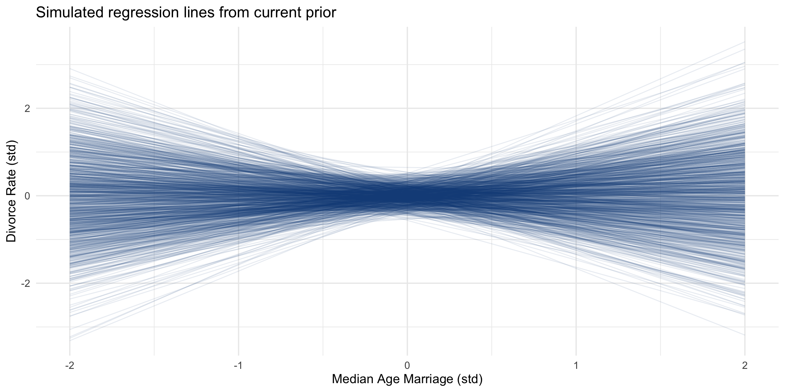
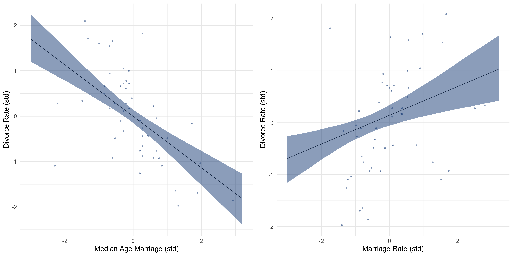
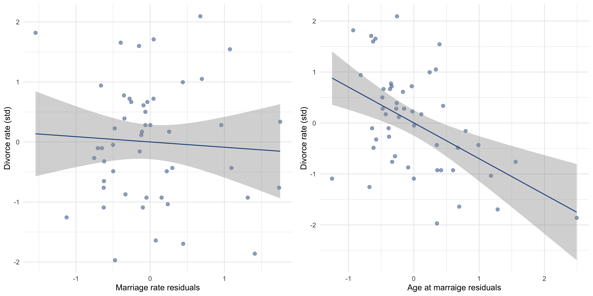
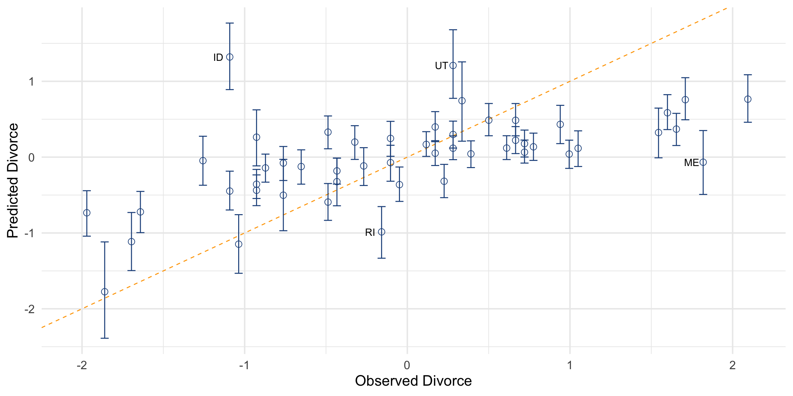
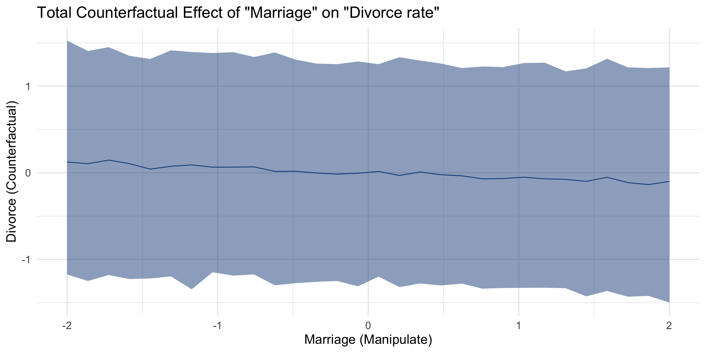
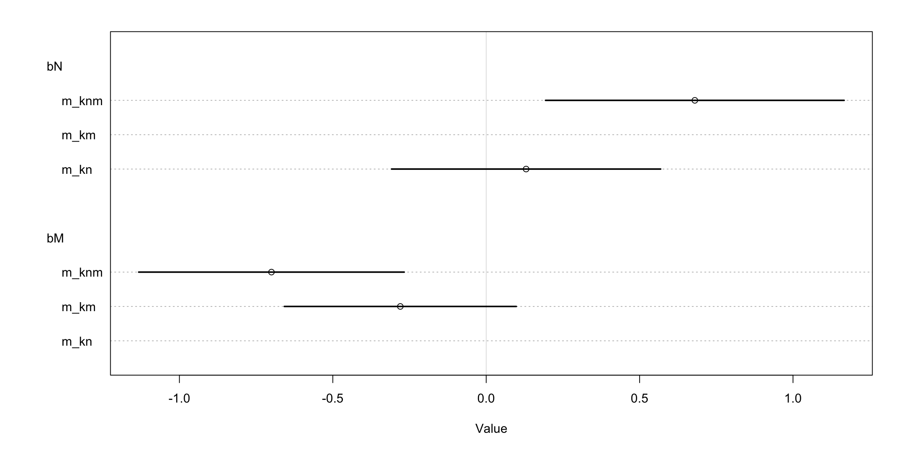
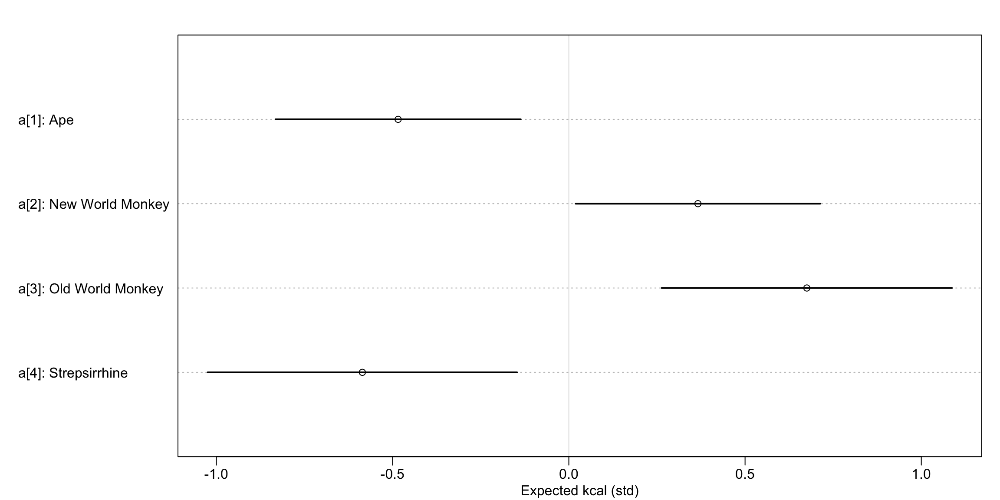

# 5. The Many Variables & The Spurious Waffles

미국 각 주의 1인당 와플집 개수와 이혼률 사이에는 높은 상관관계가 존재한다. 1인당 와플집이 많은 주들은 이혼율이 높고, 적은 주들은 이혼율이 낮다. 
와플이 결혼 생활에 위기를 불러오는 것일까? 그럴리가 없다. 이것은 상관관계를 잘못 해석한 전형적인 사례다. 
와플집은 조지아주에서 1955년에 시작되었고, 시간이 지나면서 남부 지방에 널리 퍼지게 되었다. 
그러니까 와플집이라는 변수는 사실 남부 지방과 관련이 있는 변수인 것이다. 와플집이 많다는 것과 이혼율이 높다는 것이 남부 지방에서 우연히 동시에 일어나고 있었다. 

상관 계수가 높다고 해서 인과 관계가 있다고 볼 수는 없다. 따라서 우리는 상관 관계와 인과 관계를 구분할 수 있는 도구가 필요하다. 
그래서 Multiple Regression 을 다루는데 많은 노력을 기울이고자 한다. 왜냐면 Multiple Regression 이 다음과 같은 내용들을 포함하고 있기 때문이다.

1. 교란변수에 대한 통계적인 통제 (Statistical "control" for confounds)
2. 여러 개의 인과적인 원인 (Multiple causation)
3. 상호작용 (Interaction)

# 5.1 Spurious association

조금 더 쉬운 이해를 위해 이혼율과 결혼율을 비교해보자. 이혼율과 결혼율 사이에는 상관관계가 존재한다. 
그렇다면 결혼이 이혼을 유발하는가? 결혼하지 않으면 이혼할 수 없다는 것은 확실하다. 하지만 높은 결혼율이 높은 이혼율로 이어질 이유는 없다. 
또 한 가지 이혼율과 관련된 변수는 결혼 연령이다. 결혼을 늦게 할수록 이혼율이 낮아지는 추세를 보인다. 데이터를 통해 확인해보자.

```r
library(rethinking)
library(tidyverse)

# rethinking 라이브러리에서 WaffleDivorce 데이터를 불러온다
data('WaffleDivorce', package = 'rethinking')

# 중위결혼연령 변수와 이혼율 변수를 표준화시킨다
waffle_divorce <- WaffleDivorce %>% 
    as_tibble() %>% 
    mutate(s_age = scale(MedianAgeMarriage),
           s_divorce = scale(Divorce))
```

선형 회귀 모형을 만들어보자.

```
D_i    ~ Normal(mu_i, sigma)
mu_i   = alpha + beta_A * A_i
alpha  ~ Normal(0, 0.2)
beta_A ~ Normal(0, 0.5)
sigma  ~ Exponential(1)

* D_i : i 주의 표준화된 이혼율
* A_i : i 주의 중위 결혼연령
```

각 Prior는 무엇을 의미할까? 두 변수를 모두 표준화했기 때문에 alpha는 0에 가까워질 것이다. 
`beta_A = 1` 이라면 결혼연령 값의 변화가 이혼율의 변화를 모두 설명할 수 있다는 이야기가 된다. 이건 엄청나게 강한 관계를 의미한다. 
위 Prior는 `beta_A` 기울기가 1보다 클 확률을 5% 정도로 설정한다. 

이제 Posterior를 근사시켜보자. 추가로 알아야하는 테크닉은 없다.

```r
# 모형을 fitting 한다
model_waffle_divorce <- quap(
    alist(
        s_divorce ~ dnorm(mu, sigma),
        mu <- a + bA * s_age,
        a ~ dnorm(0, 0.2),
        bA ~ dnorm(0, 0.5),
        sigma ~ dexp(1)
    ),
    data = waffle_divorce
)

# Prior를 바탕으로 시뮬레이션 해보자 (샘플링)
set.seed(123)
prior <- extract.prior(model_waffle_divorce)
prior_simulated_mu <- link(
    model_waffle_divorce, 
    post = prior , 
    # s_age = 2 또는 -2 일 때 어떤 s_divorce 값이 나올지 시뮬레이션한다
    data = list(s_age=c(-2, 2))
)

# 현재 Prior를 가정했을 때 나올만한 회귀선을 시뮬레이션하여 그래프로 표현
prior_simulated_mu %>% 
    as_tibble() %>% 
    rename(s_age = V1, s_divorce = V2) %>% 
    mutate(index = row_number()) %>% 
    ggplot() +
        geom_segment(aes(x = -2, xend = 2, y = s_age, yend = s_divorce, group = index), 
                    color = '#1D4E89', alpha = 0.1) +
        labs(x = 'Median Age Marriage (std)', y = 'Divorce Rate (std)',
            title = 'Simulated regression lines from current prior') +
        theme_minimal(base_size = 14)
```



이번에는 Posterior 예측 결과를 시뮬레이션 해보자.

이번에는 Posterior 예측 결과를 시뮬레이션 해보자. 아래 그래프를 보면 우측은 좌측 그래프에 비해 약한 상관관계를 보인다는 것을 알 수 있다. 
하지만 이런 방식의 비교로는 어떤 예측 변수가 더 나은지 알 수 없다. 두 변수가 서로 독립적일 수도 있고, 중복되거나 서로 상쇄할 수도 있다. 

```r
# 평균에 대한 Percentile Interval을 계산한다 (Median Age Marriage)
age_seq <- seq(from = -3, to = 3.2, length.out = 30)
post_mu <- link(model_waffle_divorce, data = list(s_age = age_seq))
post_mu_mean <- apply(post_mu, 2, mean)
post_mu_PI <- apply(post_mu, 2, PI)

# 그래프로 그리기 쉽게 데이터 프레임으로 묶는다
post_mu_result <- tibble(
    s_age = age_seq,
    mu_mean = post_mu_mean,
    mu_PI_05 = post_mu_PI[1,],
    mu_PI_94 = post_mu_PI[2,],
)

# 결혼율 변수도 표준화시킨다
waffle_divorce2 <- waffle_divorce %>% 
    mutate(s_marriage = scale(Marriage)[,1])

# 결혼율과 이혼율의 관계를 모형으로 fitting 한다
model_waffle_divorce2 <- quap(
    alist(
    s_divorce ~ dnorm(mu, sigma),
    mu <- a + bM * s_marriage,
    a ~ dnorm(0, 0.2),
    bM ~ dnorm(0, 0.5),
    sigma ~ dexp(1)
    ),
    data = waffle_divorce2
)

# 평균에 대한 Percentile Interval을 계산한다 (Marriage)
m_seq <- seq(from = -2, to = 3, length.out = 30)
post_mu <- link(model_waffle_divorce2, data = list(s_marriage = m_seq))
post_mu_mean <- apply(post_mu, 2, mean)
post_mu_PI <- apply(post_mu, 2, PI)

post_mu_result_marriage <- tibble(
    s_marriage = age_seq,
    mu_mean = post_mu_mean,
    mu_PI_05 = post_mu_PI[1,],
    mu_PI_94 = post_mu_PI[2,],
)

# 그래프로 확인해보자
p1 <- waffle_divorce %>% 
    ggplot(aes(x = s_age)) +
    geom_point(aes(y = s_divorce), color = '#1D4E89', alpha = 0.5) +
    geom_line(data = post_mu_result, aes(y = mu_mean)) +
    geom_ribbon(data = post_mu_result, aes(ymin = mu_PI_05, ymax = mu_PI_94),
                fill = '#1D4E89', alpha = 0.5) +
    labs(x = 'Median Age Marriage (std)', y = 'Divorce Rate (std)') +
    theme_minimal(base_size = 20)

p2 <- waffle_divorce2 %>% 
    ggplot(aes(x = s_marriage)) +
    geom_point(aes(y = s_divorce), color = '#1D4E89', alpha = 0.5) +
    geom_line(data = post_mu_result_marriage, aes(y = mu_mean)) +
    geom_ribbon(data = post_mu_result_marriage, aes(ymin = mu_PI_05, ymax = mu_PI_94),
                fill = '#1D4E89', alpha = 0.5) +
    labs(x = 'Marriage Rate (std)', y = 'Divorce Rate (std)') +
    theme_minimal(base_size = 20)

gridExtra::grid.arrange(p1, p2, ncol = 2)
```



이러한 문제를 이해하기 위해서는 인과적으로 생각해야 한다. 

## 5.1.1 Think before you regress

현재 중요한 세 가지 변수가 있다. 

- 이혼율 (D)
- 결혼율 (M)
- 중위 결혼 연령(A)

변수들 사이의 관계를 잘 이해하기 위해서, DAG (Directed Acyclic Graph) 라고 불리는 그래프를 사용하는 것이 도움이 된다. 
현재 DAG를 그려보면 다음과 같다. 이것은 몇 가지 내포하고 있는 내용이 있다. 
`A -> M` 그리고 `M -> D` 로 연결되어 있기 때문에 결혼 연령은 이혼율에 두 가지 방식으로 영향을 준다.

```
A -> M
A -> D
M -> D
```

서로 다른 화살표의 영향을 추론하기 위해서는 하나 이상의 통계 모형이 필요하다. 
`A` 를 통해 `D` 의 효과를 설명하는 회귀 모형을 만들면 모든 경로를 포함하는 전체 효과만을 알 수 있다. 
하지만 지금 문제에서는 간접적인 경로는 거의 효과가 없다. 그걸 어떻게 증명할 수 있을까?

## 5.1.2 Testable implications

데이터를 통해 가능한 여러 인과 모형을 비교하려면 어떻게 해야 할까? 
먼저 해야 할 일은 모형이 **내포하고 있는 것 중에서 테스트 가능한 내용(Testable implication)** 을 찾는 것이다. 
DAG 중에서 어떤 경우에는 특정한 조건 하에서 변수들이 독립이 되는 경우가 있다. 
이것을 **조건부 독립(Conditional Independence)** 이라고 하는데, 이것도 테스트 해볼만 한 항목이다.

조건부 독립은 두 가지 형태로 구성되어 있다. 

1. 어떤 변수들이 서로 연관되어 있고, 어떤 변수들이 연관되어 있지 않은지 나타낸다
2. 일부 변수들이 특정한 조건을 만족할 때 변수 간의 연관성이 사라지는지 여부를 나타낸다

수식으로는 다음과 같이 나타낸다.

```
Y ㅛ X|Z
: 변수 Z의 값이 주어진다면 Y와 X 변수는 서로 연관이 없다 (독립이다)
```

조건부 독립 관계를 찾는 것은 어렵지는 않다. 잘 보이지는 않지만, 조금 연습하면 금방 찾을 수 있게 된다. 
하지만 찾는 것이 어렵다면, `dagitty` 라이브러리를 사용해보자.

```r
library(dagitty)

# 조건부 독립 관계가 없는 경우
DMA_dag1 <- dagitty('dag{ D <- A -> M -> D }')
impliedConditionalIndependencies(DMA_dag1)
# 
# -> 어디에 조건을 걸든지 모든 변수가 서로 관련이 있다

# 조건부 독립 관계가 있는 경우
DMA_dag2 <- dagitty('dag{ D <- A -> M }')
impliedConditionalIndependencies(DMA_dag2)
# D _||_ M | A
# -> A값에 조건을 부여하면 (A값을 결정하면) D와 M은 서로 독립적이다
```

이러한 내용을 테스트 해보려면, A에 대해 조건부로 D와 M이 독립인지 확인해보면 된다. 
그리고 여기서 다중 회귀 분석이 도움이 된다. 다음과 같은 질문을 다룰 수 있게 된다.

> 다른 모든 예측 변수를 알고 있다면, 이 변수에 대해 더 알게 되었을 때 추가적인 가치가 있을까?

## 5.1.3 Multiple regression notation

결혼율과 결혼연령 변수를 모두 사용해서 이혼율을 예측하는 모형을 세워보면 다음과 같다.

```
D_i    ~ Normal(mu_i, sigma)                   -> Probability of data
mu_i   = alpha + beta_M * M_i + beta_A * A_i   -> Linear model
alpha  ~ Normal(0, 0.2)                        -> Prior for alpha
beta_M ~ Normal(0, 0.5)                        -> Prior for beta_M
beta_A ~ Normal(0, 0.5)                        -> Prior for beta_A
sigma  ~ Exponential(1)                        -> Prior for sigma
```

## 5.1.4 Approximating the posterior

이제 모형에 데이터를 넣고 학습시켜보자.

```
D_i    ~ Normal(mu_i, sigma)                   -> D ~ dnorm(mu, sigma)
mu_i   = alpha + beta_M * M_i + beta_A * A_i   -> mu <- a + bM*M + bA*A
alpha  ~ Normal(0, 0.2)                        -> a ~ dnorm(0, 0.2)
beta_M ~ Normal(0, 0.5)                        -> bM ~ dnorm(0, 0.5)
beta_A ~ Normal(0, 0.5)                        -> bA ~ dnorm(0, 0.5)
sigma  ~ Exponential(1)                        -> sigma ~ dexp(1)
```

```r
model_divorce_multiple <- quap(
    alist(
        s_divorce ~ dnorm(mu, sigma),
        mu <- a + bM*s_marriage + bA*s_age,
        a ~ dnorm(0, 0.2),
        bM ~ dnorm(0, 0.5),
        bA ~ dnorm(0, 0.5),
        sigma ~ dexp(1)
    ),
    data = waffle_divorce2
)

precis(model_divorce_multiple)
#        mean   sd  5.5% 94.5%
# a      0.00 0.10 -0.16  0.16
# bM    -0.07 0.15 -0.31  0.18
# bA    -0.61 0.15 -0.85 -0.37
# sigma  0.79 0.08  0.66  0.91
```

결혼율 파라미터의 posterior mean인 `bM` 이 0에 가까운 것을 볼 수 있다. 기울기 파라미터인 `bA` 와 `bM` 을 중심으로 세 모형을 비교해보자.

- `bA` 의 경우 불확실성은 조금 달라졌지만 평균이 크게 변하지는 않았다
- `bM` 의 경우 결혼 연령 변수가 모형에 없을 때만 이혼율과 관련이 있다
- **특정 주의 중위 결혼연령을 알고 있다면, 해당 주의 결혼율 정보를 아는 것은 예측력에 큰 도움이 되지 않는다는** 것을 의미한다

```r
# 빠른 이해를 위해 모형 이름을 변경한다
model_age = model_waffle_divorce
model_marriage_rate = model_waffle_divorce2
model_multiple = model_divorce_multiple

coeftab(model_age, model_marriage_rate, model_multiple)
#       model_age model_marriage_rate model_multiple
# a           0         0                   0       
# bA      -0.57        NA               -0.61       
# sigma    0.79      0.91                0.79       
# bM         NA      0.35               -0.07       
# nobs       50        50                  50
```

이것은 결혼율 정보를 알아봤자 도움이 안된다는 이야기가 아니다. 
이것은 **"결혼율"에서 "이혼율" 변수로 이어지는 직접적인 인과 관계가 없거나 거의 없다는 것을** 의미한다!

## 5.1.5 Plotting multivariate posteriors

예측 변수가 한 개일 때는 그래프로 간단히 그릴 수 있었지만, 두 개 이상의 예측 변수를 사용하게 되면 그래프를 더 많이 그려야 한다. 
해석을 도와주는 세 가지 그래프를 살펴보자.

1. Predictor residual plots
    - 결과 변수와 잔차를 비교한다
    - 통계 모형을 이해하는 데는 도움이 되지만, 다른 역할은 크게 없다
2. Posterior prediction plots
    - 원본 데이터와 모형을 통한 예측 결과를 비교한다
    - 학습 및 예측 결과를 확인하기 위해 사용한다
3. Counterfactual plots
    - 가상의 실험에 대한 예측 결과를 보여준다
    - 1개 이상의 변수에 대한 인과적인 영향을 확인하기 위해 사용한다

### 5.1.5.1 Predictor residual plots

예측 변수 잔차는 다른 모든 예측 변수로 특정 예측 변수를 설명하는 모형을 만들었을 때의 평균 오차를 의미한다. 
이것을 계산하면 다른 모든 예측 변수들에 대해 통제(controlled)된 회귀 모형을 구할 수 있다는 장점이 있다. 
이혼율 모형에서 우리는 2개의 예측 변수를 가지고 있다. 그 중 결혼율에 대해서 살펴본 다면, 다음과 같이 모형을 설정할 수 있다.

```r
model_M_from_A <- quap(
    alist(
        s_marriage ~ dnorm(mu, sigma),
        mu <- a + bAM * s_age,
        a ~ dnorm(0, 0.2),
        bAM ~ dnorm(0, 0.5),
        sigma ~ dexp(1)
    ), 
    data = waffle_divorce2
)
```

이제 잔차(residuals)를 계산하기 위해서는 실제 결혼율에서 예측한 결혼율 값을 뺀다.

```r
mu_M_resid <- model_M_from_A %>% 
    link() %>% 
    apply(2, mean) %>% 
    { waffle_divorce2$s_marriage - . }
```

이제 이 값을 이혼율 변수와 비교해보자. x축에 잔차, y축에 이혼율 변수로 그래프를 그린다. 
이 그래프(좌측 그래프)는 결혼 연령 변수를 통제(controlled)했을 때, 이혼율과 결혼율 변수의 선형 관계를 보여준다. 

```r
# 아래에서 왼쪽 그래프를 그리기 위한 코드
waffle_divorce2 %>% 
    mutate(mu_M_resid = mu_M_resid) %>% 
    ggplot(aes(x = mu_M_resid, y = s_divorce)) +
    geom_point(size = 4, color = '#1D4E89', alpha = 0.5) +
    geom_smooth(method = 'lm', color = '#1D4E89') +
    labs(x = 'Marriage rate residuals', y = 'Divorce rate (std)') +
    theme_minimal(base_size = 20)
```



선형 회귀 모형은 변수들이 서로 연관되어 있는 것을 각 변수를 서로 더하는 형태로 표현한다. 
하지만 예측 변수들은 더하기가 아닌 형태로 영향을 미치기도 한다. 이 경우에는 큰 틀에서는 동일하지만 세부적인 내용은 조금 달라질 수 있다. 
이런 경우에는 모형을 파악하기 위해 다른 방법을 사용할 수 있다. 바로 다음에 나오는 내용을 사용한다.

### 5.1.5.2 Posterior prediction plots

모형의 예측 결과와 실제 값을 비교하는 작업도 중요하다. 이미 3장에서 했던 내용이지만, 여러모로 유용하게 사용할 수 있다. 여기서는 2가지 활용 방법에 집중한다.

1. 모형이 Posteior 분포를 제대로 학습했을까?
2. 모형이 어떤 부분에서 어떻게 실패하는가?

이혼율 예제에서 Posterior predictive check를 수행하려면 어떻게 해야 할까? 코드를 통해 살펴보자. 
먼저 예측 결과를 시뮬레이션하고, posterior의 평균을 구한다.

```r
# link 함수를 사용할 때 새로운 데이터를 명시하지 않으면 기존 데이터를 사용한다
mu_obs <- link(model_multiple)
# 샘플링 결과를 필요에 따라 요약한다
mu_obs_mean <- apply(mu_obs, 2, mean)
mu_obs_PI <- apply(mu_obs, 2, PI)

# 관측치를 시뮬레이션한다
# 여기서도 새로운 데이터를 적용하지 않으면 기존 데이터를 사용한다
D_obs_sim <- sim(model_multiple, n = 1e4)
D_obs_PI <- apply(D_obs_sim, 2, PI)
```

다변량 모형에서는 시뮬레이션 결과를 시각화하는 방법이 여러 가지 존재할 수 있다. 역시 가장 간단한 방법은 관측치와 예측치를 비교하는 것이다.

```r
waffle_divorce2 %>% 
    mutate(mu_obs_mean = mu_obs_mean,
            mu_obs_PI_05 = mu_obs_PI[1,],
            mu_obs_PI_94 = mu_obs_PI[2,]) %>% 
    ggplot(aes(x = s_divorce, y = mu_obs_mean)) +
    geom_abline(slope = 1, intercept = 0, color = 'orange', linetype = 2) +
    geom_point(size = 3, color = '#1D4E89', shape = 21) +
    geom_errorbar(aes(ymin = mu_obs_PI_05, ymax = mu_obs_PI_94), color = '#1D4E89') +
    geom_text(aes(label = if_else(as.character(Loc) %in% c('ID', 'UT', 'RI', 'ME'), as.character(Loc), '')), nudge_x = -0.07) +
    labs(x = 'Observed Divorce', y = 'Predicted Divorce') +
    theme_minimal(base_size = 16)
```



Idaho 와 Utah 주는 왜 예측치와 차이가 클까? 
두 주에는 예수 그리스도 후기 성도 교회(the Church of Jesus Christ of Latter-day Saints)의 신도들이 많다. 
여기 신도들은 어디에 살든 대체로 낮은 이혼율을 보인다. 이렇게 결혼 연령 이외의 다른 변수들을 주의깊게 살펴보면 현상을 이해하는데 도움이 되는 경우가 있다.

### 5.1.5.3 Counterfactual plots

모형이 내포하는 예측 결과를 확인할 수 있는 또 한 가지 방법으로 **Counterfactual plots** 가 있다. 
관측된 적이 없거나 불가능한 조합에 대해서도 그려볼 수 있기 때문에 저런 이름을 붙이게 되었다. 
특성상 말이 되지 않는 조합을 그리지 않도록 조심해야 하지만, 잘 사용하면 가상의 개입에 대한 예측을 생성하고 모형을 이해하는데 도움이 된다. 
Counterfactual plot의 가장 단순한 사용법은 변수 중 하나의 값을 바꾸었을 때 예측값이 어떻게 변하는지를 확인하는 것이다. 

다음과 같은 방식으로 그래프를 그릴 수 있다.

1. 값을 변경하려는 변수를 선택한다 (intervention variable)
2. intervention variable 의 값이 어디까지 변경될 수 있을지 구간을 설정한다
3. intervention variable 의 각 값에 대해서, 그리고 posterior의 각 샘플에 대해 인과 모형을 통해 결과를 포함한 다른 변수들의 값을 시뮬레이션한다

A의 M에 대한 효과를 추정하려면, A의 M에 대한 회귀모형을 구성해야 한다. DAG 상에서 A와 M 사이에는 그 외에 다른 변수가 없기 때문이다. 
`quap` 함수를 통해 두 개의 회귀 모형을 동시에 수행해보자.

```r
model_multiple_A <- quap(
    alist(
        ## A -> D <- M
        s_divorce ~ dnorm(mu, sigma),
        mu <- a + bM*s_marriage + bA*s_age,
        a ~ dnorm(0, 0.2),
        bM ~ dnorm(0, 0.5),
        bA ~ dnorm(0, 0.5),
        sigma ~ dexp(1),

        ## A -> M
        s_marriage ~ dnorm(mu_M, sigma_M),
        mu_M <- aM + bAM*s_age,
        aM ~ dnorm(0, 0.2),
        bAM ~ dnorm(0, 0.5),
        sigma_M ~ dexp(1)
    ),
    data = waffle_divorce2
)
```

모형의 학습 결과를 살펴보자. M과 A 변수가 강하게 음의 상관관계로 연결되어 있는 것을 볼 수 있다. 만약에 우리가 이것을 인과 관계로 해석한다면, A값을 증가시킬 때 M 값이 줄어들 것이라고 생각할 수 있다.

```r
precis(model_multiple_A)
#          mean   sd  5.5% 94.5%
# a        0.00 0.10 -0.16  0.16
# bM      -0.07 0.15 -0.31  0.18
# bA      -0.61 0.15 -0.85 -0.37
# sigma    0.79 0.08  0.66  0.91
# aM       0.00 0.09 -0.14  0.14
# bAM     -0.69 0.10 -0.85 -0.54
# sigma_M  0.68 0.07  0.57  0.79
```

이제 시뮬레이션을 통해 A값을 변경했을 때 어떻게 변할지 살펴보자. 

```r
# A변수의 30개 지점을 생성한다
sim_data <- tibble(s_age = seq(from = -2, to = 2, length.out = 30))

# 위에 생성한 A 변수를 통해 M, D 변수를 시뮬레이션한다
sim_result <- sim(
    model_multiple_A, 
    data = sim_data, 
    vars = c('s_marriage','s_divorce')
)

# 그래프를 그리기 위한 결과값을 추려서 데이터프레임을 생성한다
counterfactual_result <- tibble(
    age_manipulated = sim_data$s_age,
    divorce_counterfactual = colMeans(sim_result$s_divorce),
    divorce_PI_05 = apply(sim_result$s_divorce, 2, PI)[1,],
    divorce_PI_94 = apply(sim_result$s_divorce, 2, PI)[2,],
)

# 그래프를 그려서 확인한다
ggplot(counterfactual_result, aes(x = age_manipulated)) +
    geom_line(aes(y = divorce_counterfactual), color = '#1D4E89') +
    geom_ribbon(aes(ymin = divorce_PI_05, ymax = divorce_PI_94), fill = '#1D4E89', alpha = 0.5) +
    labs(x = 'Age (Manipulate)', y = 'Divorce (Counterfactual)',
        title = 'Total Counterfactual Effect of "Age" on "Divorce rate"') +
    theme_minimal(base_size = 16)
```


위 그래프에서 D 값의 추이는 2개의 경로를 의미한다.

- A → D
- A → M → D

이 중에서 M → D 의 효과가 매우 작다는 것을 이전에 확인했기 때문에, 두 번째 경로는 큰 영향을 미치지 못한다. 
하지만 만약 M이 D에 큰 영향을 미치는 상황이라면 위 그래프에도 해당 내용이 포함될 것이다. 
코드에서 생성한`sim_result` 변수에는 M 변수의 시뮬레이션 결과까지 포함되어 있기 때문에 필요하면 확인해보자.

Counterfactual 에서 사용하는 트릭은 어떤 변수 X의 값을 임의로 변경할 때, 다른 변수들이 X에 미치는 인과적인 영향을 무너뜨리게 된다는 것을 깨닫는 것이다. 
다시 말해 어떤 화살표도 X를 향하지 않도록 DAG를 수정하면 된다. M 변수 값을 변화시킬 때 영향을 파악하려 한다면 다음과 같이 DAG를 수정해야 한다.

```
A -> D
M -> D
```

화살표 `A → M` 이 제거되었다. 왜냐면 우리가 M 값을 임의로 변경한다는 것은, A가 더이상 M 변수에 영향을 미치지 못한다는 것을 의미하기 때문이다. 
이건 마치 완벽하게 통제된 실험과 비슷한 상황이 된다. 이번에는 평균적인 연령대, 즉 `A=0` 인 주에서 M 변수가 변하면 어떤 영향이 있을지 시뮬레이션 해보자.

```r
# 시뮬레이션을 위한 데이터를 생성한다
# * M은 확인하려는 구간 내에 30개 데이터를 생성
# * A는 0으로 고정
sim_data <- tibble(
    s_marriage = seq(from = -2, to = 2, length.out = 30),
    s_age = 0
)

# 시뮬레이션 결과를 생성한다 (D변수만 생성한다)
sim_result <- sim(
    model_multiple_A, 
    data = sim_data, 
    vars = c('s_divorce')
)

# 그래프를 그리기 위한 결과값을 추려서 데이터프레임을 생성한다
counterfactual_result <- tibble(
    marriage_manipulated = sim_data$s_marriage,
    divorce_counterfactual = colMeans(sim_result),
    divorce_PI_05 = apply(sim_result, 2, PI)[1,],
    divorce_PI_94 = apply(sim_result, 2, PI)[2,],
)

# 그래프를 그려서 확인한다
ggplot(counterfactual_result, aes(x = marriage_manipulated)) +
    geom_line(aes(y = divorce_counterfactual), color = '#1D4E89') +
    geom_ribbon(aes(ymin = divorce_PI_05, ymax = divorce_PI_94), fill = '#1D4E89', alpha = 0.5) +
    labs(x = 'Marriage (Manipulate)', y = 'Divorce (Counterfactual)',
        title = 'Total Counterfactual Effect of "Marriage" on "Divorce rate"') +
    theme_minimal(base_size = 16)
```



그래프로 확인한 결과 효과가 크지 않은 것으로 보인다. 앞에서 살펴본 대로, M의 D에 대한 효과는 크다고 보기 어렵다는 것을 알 수 있다.

가능한 경로가 더 많은 복잡한 모형에서도 비슷한 방식으로 그래프를 그려볼 수 있다. 
하지만 종종 계산하는 것이 불가능할 때가 있는데, 그러한 경우에도 고민해볼 만한 방식들이 있다. 이 부분에 대해서는 나중에 다루어보자.

**참고. Counterfactual 시뮬레이션하기**

위 예제에서는 `sim` 함수를 사용하고 자세한 내용은 설명하지 않았다. 하지만 다음과 같이 직접 구현할 수 있다.

```r
# (1) Age 변수에 할당하고자 하는 값의 범위를 입력한다
A_manipulated <- seq(from = -2, to = 2, length.out = 30)

# (2) Posterior 샘플링 결과를 추출한다
# * 여기서 사용하는 모형에는 Marriage 변수의 분포가 정의되어 있다
# * 따라서 rnorm 함수를 통해 시뮬레이션을 위한 함수를 직접 구현한다
posterior_samples <- extract.samples(model_multiple_A)
M_simulated <- with(posterior_samples, sapply(1:30, function(i) {
    rnorm(1e3, aM + bAM*A_manipulated[i], sigma_M)
}))

# (3) 시뮬레이션을 통해 Divorce 변수를 생성한다
D_simulated <- with(posterior_samples, sapply(1:30, function(i) {
    rnorm(1e3, a + bA*A_manipulated[i] + bM*M_simulated[,i], sigma)
}))

# (4) 그래프를 통해 확인해보면 위에서 그린 것과 동일한 그래프를 확인할 수 있다
tibble(
    A_manipulated = A_manipulated,
    D_sim = colMeans(D_simulated),
    D_sim_PI_05 = apply(D_simulated, 2, PI)[1,],
    D_sim_PI_94 = apply(D_simulated, 2, PI)[2,],
) %>% 
    ggplot(aes(x = A_manipulated)) +
    geom_line(aes(y = D_sim)) +
    geom_ribbon(aes(ymin = D_sim_PI_05, ymax = D_sim_PI_94), alpha = 0.5)
```

# 5.2 Masked Relationship

이혼율 예제는 여러 개의 예측 변수를 사용한 모델링이 가짜 상관 관계를 걸러내는데 도움이 된다는 것을 알려준다. 
여러 개의 예측 변수를 사용하는 것이 좋은 또 다른 이유는, 각각의 변수들이 가지는 효과가 명확하지 않을 때 여러 요인들로 인해 발생하는 효과를 측정할 수 있기 때문이다.
이러한 문제는 여러 변수들이 서로 연관되어 있을 때 종종 발생한다. 

새로운 데이터를 통해 확인해보자.

```r
data('milk', package = 'rethinking')
# kcal.per.g     : 1g 당 에너지 (kcal)
# mass           : 여성의 평균 체중 (kg)
# neocortex.perc : 전체 뇌에서 대뇌 신피질이 차지하는 비중 (%)

# 위 세 가지 변수를 표준화한다
milk_data <- milk %>% 
    as_tibble() %>% 
    mutate(K = scale(kcal.per.g)[,1],
            N = scale(neocortex.perc)[,1],
            M = scale(log(mass))[,1])
```

첫 번째 모형은 kcal과 neocortex 사이의 간단한 회귀 모형이다. 그런데 코드를 돌려보면 다음과 같은 에러가 발생한다. 
`N` 변수에 있는 NA 값 떄문에 초기 확률 값을 설정하지 못해서 발생하는 문제다.

```r
m_kn <- quap(
    alist(
        K ~ dnorm(mu, sigma),
        mu <- a + bN*N,
        a ~ dnorm(0, 0.2),
        bN ~ dnorm(0, 0.5),
        sigma ~ dexp(1)
    ), 
    data = milk_data
)
# Error in quap(alist(K ~ dnorm(mu, sigma), mu <- a + bN * N, a ~ dnorm(0,  : 
#   initial value in 'vmmin' is not finite
# The start values for the parameters were invalid. 
# This could be caused by missing values (NA) in the data or by start values outside the parameter constraints. 
# If there are no NA values in the data, try using explicit start values.
```

이러한 문제를 처리하는 간단한 방법이 있다. 바로 결측치가 존재하는 모든 경우를 제거하는 것이다. 
이것을 보통 **Complete Case Analysis** 라고 한다. 이렇게 하는 것이 항상 좋은 것은 아니지만, 지금은 그냥 해보자. 

```r
# K, N, M 변수 중에서 NA값이 없는 항목만 추출한다
milk_cc <- milk_data %>% 
    filter(complete.cases(K, N, M))

# 다시 모델링해본다. 이번에는 에러 없이 잘 된다.
m_kn <- quap(
    alist(
        K ~ dnorm(mu, sigma),
        mu <- a + bN*N,
        a ~ dnorm(0, 0.2),
        bN ~ dnorm(0, 0.5),
        sigma ~ dexp(1)
    ), 
    data = milk_cc
)
```

Posterior 결과를 살펴보자. 상관 관계가 강하지도 않고, 정확하지도 않다는 것을 알 수 있다. 

```r
precis(m_kn)
#       mean   sd  5.5% 94.5%
# a     0.04 0.15 -0.21  0.29
# bN    0.13 0.22 -0.22  0.49
# sigma 1.00 0.16  0.74  1.26
```

비슷한 모형을 체중 변수를 사용해서 만들어보자. log(체중) 변수는 kcal 변수와 음의 상관관계를 가진다. 게다가 neocortex 변수와 비교했을 때 영향이 더 큰 것으로 보인다. 

```r
# kcal ~ Mass
m_km <- quap(
    alist(
        K ~ dnorm(mu, sigma),
        mu <- a + bM*M ,
        a ~ dnorm(0, 0.2),
        bM ~ dnorm(0, 0.5),
        sigma ~ dexp(1)
    ),
    data = milk_cc
)

precis(m_km)
#        mean   sd  5.5% 94.5%
# a      0.05 0.15 -0.20  0.29
# bM    -0.28 0.19 -0.59  0.03
# sigma  0.95 0.16  0.70  1.20
```

이번에는 두 예측 변수를 동시에 사용했을 때 어떻게 변하는지 살펴보자.

```r
# kcal ~ Neocortex + Mass
m_knm <- quap(
    alist(
        K ~ dnorm(mu, sigma),
        mu <- a + bN*N + bM*M ,
        a ~ dnorm(0, 0.2),
        bN ~ dnorm(0, 0.5),
        bM ~ dnorm(0, 0.5),
        sigma ~ dexp(1)
    ),
    data = milk_cc
)

precis(m_knm)
#        mean   sd  5.5% 94.5%
# a      0.07 0.13 -0.15  0.28
# bN     0.68 0.25  0.28  1.07
# bM    -0.70 0.22 -1.06 -0.35
# sigma  0.74 0.13  0.53  0.95
```

각 모형의 효과 추정치를 비교해보자. N, M 변수 각각 따로 모델링햇을 때는 효과가 그다지 크지 않은 것으로 추정되었는데, 
두 변수를 모두 사용하여 모델링하니 두 변수의 효과가 모두 급격하게 증가한 것을 볼 수 있다. 

```r
plot(coeftab(m_kn, m_km, m_knm), pars = c('bN', 'bM'))
```



왜 이런 일이 발생하는 걸까? 두 변수 모두 결과 변수와 상관 관계가 존재하는데, 하나는 양의 상관관계가 있고 또 하나는 음의 상관관계가 있기 때문에 이런 결과가 나타났다. 
게다가 두 예측 변수는 서로 높은 양의 상관관계가 존재한다. 그 결과 두 예측 변수가 서로의 효과를 상쇄시키는 결과가 나타난다. 
이번 문제도 다중 회귀 모형을 통해 명확하게 효과를 추정할 수 있다는 것을 보여주는 사례다. 

DAG를 통해 살펴보자. 이런 패턴에는 적어도 세 가지의 그래프가 적용될 수 있다.

```
(1)
M    ->   N
M -> K <- N

(2)
M    <-   N
M -> K <- N

(3) Unobserved Variable 'U'
M <- U -> N
M -> K <- N
```

이 중에 어떤 그래프가 정답일까? 데이터만으로는 알 수 없다. 왜냐면 세 그래프 모두 동일한 조건부 독립 관계로 이루어져 있기 때문이다. 
동일한 조건부 독립 관계를 나타내는 DAG 집합을 **Markov Equivalence** 집합이라고 한다. 
데이터 만으로는 어떤 인과 모형이 맞는지 알 수 없지만, 각 변수에 대한 과학적인 지식을 바탕으로 상당수의 말이 되지 않는 DAG를 제거할 수 있다. 

마지막으로 모형을 통해 해야하는 작업은 Counterfactual plot을 그려보는 것이다. 
여러 개의 예측 변수가 존재할 때, 다른 변수들이 고정되어 있다고 가정하고 가상의 실험을 수행해 볼 수 있다. 
실제 세계에서 이러한 실험은 불가능하다. 하지만 이러한 그래프를 통해 모형이 변수간의 관계를 어떻게 구성하고 있는지 이해하는데 도움이 된다.

# 5.3 Categorical Variables

통계적인 방법론에서 자주 다루게 되는 주제 중 하나는 특정한 카테고리의 존재 여부에 따라 결과가 얼마나 바뀌는지 알아내는 것이다. 
여기서 카테고리는 이산적이며 순서가 없는 것을 말한다. 

## 5.3.1 Binary Categories

아래 데이터에서 `male` 변수는 카테고리를 수치형 변수처럼 사용하기 위한 지시 변수(Indicator Variable, 또는 Dummy Variable)이다. 

```r
data('Howell1', package = 'rethinking')
str(Howell1)
# 'data.frame':	544 obs. of  4 variables:
#  $ height: num  152 140 137 157 145 ...
#  $ weight: num  47.8 36.5 31.9 53 41.3 ...
#  $ age   : num  63 63 65 41 51 35 32 27 19 54 ...
#  $ male  : int  1 0 0 1 0 1 0 1 0 1 ...
```

지시 변수를 모델링에서 활용하는 방법은 크게 두 가지가 있다.

1. 지시변수를 모형 내에서 수치형 변수인 것처럼 직접 사용한다
    - 동일한 alpha 값이 여러 카테고리에 모두 적용되어야 하기 때문에, **alpha 값에 적당한 prior를 배치하는 것이 어렵다**
    - **beta** 파라미터는 **해당 카테고리의 여부에 따른 차이를** 의미하게 된다
    - 이 방식을 쓸 경우 **특정 카테고리 (여기서는 male인 경우)의 불확실성이 더 커진다**
        - 왜냐면 남성의 경우에는 추정하는데 2개의 파라미터가 필요하기 때문!
2. Index 변수로 사용한다
    - 2개 이상의 카테고리에도 쉽게 적용할 수 있다
    - alpha 파라미터를 카테고리 개수만큼 만들고, 각각의 파라미터에 prior를 설정한다

```
(1) Indicator Variable
h_i    ~ Normal(mu_i, sigma)
mu_i  <- alpha + beta_m * m_i     m_i = 1 or 0
alpha  ~ Normal(178, 20)
beta_m ~ Normal(0, 10)
sigma  ~ Uniform(0, 50)

(2) Index Variable
h_i     ~ Normal(mu_i, sigma)
mu_i   <- alpha_{SEX[i]}
alhpa_j ~ Normal(178, 20)         for j=1,2
sigma   ~ Uniform(0, 50)
```

R 코드를 통해 확인해보자. 두 카테고리 모두 비슷한 불확실성 범위를 보이는 것을 볼 수 있다.

```r
# 여성이면 1, 남성이면 2가 되도록 index variable을 추가한다
howell_indexed <- Howell1 %>% 
    as_tibble() %>% 
    mutate(sex = if_else(male == 1, 2, 1))

# 모형을 통해 Posterior를 근사한다
m_hs_index <- quap(
    alist(
        height ~ dnorm(mu, sigma),
        mu <- a[sex],
        a[sex] ~ dnorm(178, 20),
        sigma ~ dunif(0, 50)
    ),
    data = howell_indexed
)

# 파라미터 학습 결과를 확인한다
# * depth=2 옵션을 통해 벡터 파라미터를 모두 표시하도록 한다
precis(m_hs_index, depth = 2)
#         mean   sd   5.5%  94.5%
# a[1]  134.91 1.61 132.34 137.48
# a[2]  142.58 1.70 139.87 145.29
# sigma  27.31 0.83  25.99  28.63
```

파라미터를 해석하는 것도 어렵지 않다. a 벡터는 각 카테고리별 기대값을 의미한다. 
그러면 카테고리별 차이는 어떻게 구할 수 있을까? Posterior 샘플링 결과를 통해 계산할 수 있다.

```r
posterior_samples <- extract.samples(m_hs_index)
posterior_samples$diff_fm <- with(posterior_samples, a[,1] - a[,2])

precis(posterior_samples, depth = 2)
# quap posterior: 10000 samples from m_hs_index
#           mean   sd   5.5%  94.5%     histogram
# sigma    27.31 0.82  25.98  28.64 ▁▁▁▁▃▇▇▇▃▂▁▁▁
# a[1]    134.89 1.64 132.27 137.52 ▁▁▁▁▂▅▇▇▅▂▁▁▁
# a[2]    142.58 1.72 139.88 145.34      ▁▁▅▇▃▁▁▁
# diff_fm  -7.69 2.38 -11.46  -3.88   ▁▁▁▁▃▇▇▃▁▁▁
```

계산 결과가 새로운 파라미터인 것처럼 나타난다. 이것은 샘플에서 남성과 여성의 키 차이 기대값을 나타낸다. 

## 5.3.2 Many Categories

카테고리 항목의 개수가 2개일 때는 어떤 방식을 쓰든 어렵지 않지만, 카테고리 수가 많아지면 지시 변수로는 감당하기가 어려워진다. 
`k` 개의 카테고리가 존재한다면 `k-1` 개의 지시 변수가 필요하다. R에서는 이러한 작업을 자동으로 처리해주지만, 여기서는 Index 변수를 사용하도록 한다. 

milk 데이터를 다시 살펴보자. 이번에는 각 종의 분류체계를 나타내는 `clade` 변수에 주목해보자.

```r
data('milk', package = 'rethinking')

# clade 값으로 인덱스 변수를 생성한다
milk_indexed <- milk %>% 
    as_tibble() %>% 
    mutate(clade_id = as.integer(clade),
            K = scale(kcal.per.g)[,1])

# 모형을 통해 Posterior를 근사한다
m_milk_kc <- quap(
    alist(
        K ~ dnorm(mu, sigma),
        mu <- a[clade_id],
        a[clade_id] ~ dnorm(0, 0.5),
        sigma ~ dexp(1)
    ), 
    data = milk_indexed
)

# 그래프를 통해 확인해보자
plot(
    precis(m_milk_kc, depth = 2, pars = 'a'), 
    labels = map2_chr(1:4, levels(milk_indexed$clade), ~ glue::glue('a[{.x}]: {.y}')), 
    xlab = 'Expected kcal (std)'
)
```


