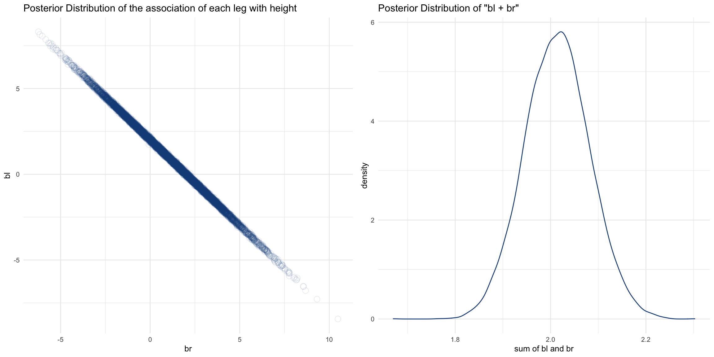

# 6. The Haunted DAG & The Causal Terror

가장 뉴스거리가 되는 과학 연구들은 가장 믿을 것이 못되는 것처럼 보인다. 나에게 가장 해가 되는 것처럼 보일수록, 사실은 그렇지 않은 경우가 있다. 
지루한 주제일수록 결과는 더 가치있다. 이런 음의 상관관계가 어떻게 존재할 수 있는 것일까? 
실제로 이런 음의 상관관계가 발생하기 위해서는 논문을 리뷰하는 사람이 뉴스로서의 가치와 신뢰성에 관심을 가지기만 하면 된다. 
그렇게 되면 선택하는 행위 그 자체만으로도 뉴스로서 가치가 높을수록 신뢰성이 낮아 보이게 만들 수 있다.

이런 현상을 **Berkson's Paradox** 라고 한다. 하지만 쉽게 이해하려면 **선택 편향** 효과라고 생각하면 된다. 
이게 다중 회귀 모형과 어떤 관계가 있을까? 안타깝게도, 모든 것이 연관되어 있다. 
이전 장의 내용만 놓고 보면 잘 모르겠을 때는 모든 변수를 모형에 넣으면 알아서 잘 처리해 줄 것처럼 보인다. 하지만 그렇지 못하는 경우도 있다. 
회귀 모형은 예언자처럼 수수께기 같은 이야기를 하고, 우리가 잘못된 질문을 던지면 그 대가를 치루게 한다. 선택 편향 문제는 다중 회귀 모형 안에서도 일어날 수 있다. 
예측 변수를 추가하는 행동으로 인해 통계적인 선택이 이루어지고, 그 결과 이름만으로는 무슨 의미인지 알기 어려운 **충돌 편향(Collider Bias)** 이 발생한다. 
이것이 특정한 변수에 조건을 부여했을 때, 뉴스로서의 가치와 신뢰성 사이의 음의 상관관계가 있는 것처럼 느껴지게 하는 잘못된 해석을 하게 만든다.

이번 장에서는 세 가지 큰 위험에 대해 다룬다. 

- Multicollinearity
- Post-treatment bias
- Collider bias

그리고 유효한 통계적 추론을 위해 어떤 변수를 넣거나 빼야하는지 알아보는 방법에 대해서 다룬다.

# 6.1 Multicollinearity

다중 공선성(Multicollinearity) 은 두 개 이상의 예측 변수가 서로 강한 상관관계를 가지는 경우를 말한다. 
그 결과 모든 변수가 결과 변수와 연관있더라도 어떤 변수도 결과 변수와 연관이 없다는 결론을 내리게 된다. 
이런 현상은 다중 회귀모형이 동작하는 방식 때문에 발생한다. 간단한 시뮬레이션을 통해 살펴보자.

## 6.1.1 Multicollinear legs

사람의 다리 길이를 통해 키를 예측하는 시뮬레이션을 해보자. 키는 다리 길이와 관련이 있다. 
그렇지 않더라도 적어도 이번 시뮬레이션에서는 그렇게 가정하고 있다. 하지만 두 다리 길이를 모두 모형에 넣으면, 무엇인가 이상한 일이 일어난다. 

100명의 데이터를 시뮬레이션으로 생성해보자. 평균적으로 다리 길이는 키의 45% 정도가 되도록 설정해두었기 때문에, beta 계수는 2.2 정도가 될 것이라고 예상해 볼 수 있다. 
(평균 키 / 평균 다리 길이 = 10 / 4.5 = 2.2)

```r
library(rethinking)
library(tidyverse)

simulate_height <- function(N, seed = 123) {
    # N : 시뮬레이션 하려는 인원수
    set.seed(seed)                 # Random Seed 설정
    leg_prop <- runif(N, 0.4, 0.5) # 키 대비 다리의 비율
    
    # 키, 왼다리, 오른다리 길이를 시뮬레이션한다
    tibble(
        height = rnorm(N, 10, 2),
        leg_left = leg_prop*height + rnorm(N, 0, 0.02), 
        leg_right = leg_prop*height + rnorm(N, 0, 0.02)
    )
}

# 100명의 키를 시뮬레이션으로 생성한다
height_data <- simulate_height(100)
```

이런 데이터에 매우 모호하고 잘못된 prior를 적용할 경우 어떻게 되는지 살펴보자. 그래프를 그려보면 posterior 평균과 표준 편차가 정말 이상하는 것을 볼 수 있다. 

```r
m_leg_01 <- quap(
    alist(
        height ~ dnorm(mu, sigma),
        mu <- a + bl*leg_left + br*leg_right,
        a ~ dnorm(10, 100),
        bl ~ dnorm(2, 10),
        br ~ dnorm(2, 10),
        sigma ~ dexp(1)
    ),
    data = height_data
)

precis(m_leg_01)
#       mean   sd  5.5% 94.5%
# a     0.96 0.31  0.47  1.45
# bl    0.95 2.21 -2.58  4.47
# br    1.06 2.20 -2.46  4.58
# sigma 0.61 0.04  0.54  0.68

plot(precis(m_leg_01))
```


Posteior 학습은 잘 되었다. 그리고 posterior 분포는 우리의 질문에 적합한 대답을 해주었다. 문제는 바로 그 질문이다. 질문은 다음과 같다.

> 다른 쪽 다리의 길이를 이미 알고 있을 때, 한 쪽 다리 길이를 추가로 알게되는 것은 얼마나 가치있을까?

이 이상한 질문에 대한 답변은 여전히 이상하지만, 매우 논리적이다. 우선 bl 과 br 의 Posterior 분포를 그래프로 그려서 살펴보자.

```r
# Posterior 분포로부터 샘플링한다
m_leg_01_posterior <- m_leg_01 %>% 
    extract.samples() %>% 
    as_tibble()

p1 <- m_leg_01_posterior %>% 
    ggplot(aes(x = br, y = bl)) +
    geom_point(size = 3, color = '#1D4E89', shape = 21, alpha = 0.1) +
    labs(title = 'Posterior Distribution of the association of each leg with height') +
    theme_minimal(base_size = 10)

p2 <- m_leg_01_posterior %>% 
    mutate(sum_bl_br = bl + br) %>% 
    ggplot(aes(x = sum_bl_br)) +
    geom_density(color = '#1D4E89') +
    labs(x = 'sum of bl and br',
        title = 'Posterior Distribution of "bl + br"') +
    theme_minimal(base_size = 10)

gridExtra::grid.arrange(p1, p2, ncol = 2)
```



두 파라미터의 posterior 분포는 매우 상관관계가 크다. bl 이 커지면 br 이 작아진다. 
두 변수가 거의 같은 값을 가지기 때문에, 동일한 예측을 하는 bl, br 조합을 거의 무한하게 생성해 낼 수 있다.

이 현상을 설명하기 위해 모형을 다음과 같이 근사시켰다고 생각해보자. 동일한 `x_i` 값이 두 번 사용되었기 때문에 현재 우리가 처한 상황과 매우 유사하다.

```
y_i ~ Normal(mu_i, sigma)
mu_i <- alpha + beta1*x_i + beta2*x_i
     <- alpha + (beta1 + beta2)*x_i
```

위 수식에서 beta1, beta2 파라미터는 분리될 수 없다. 둘 다 독립적으로 `mu` 에 영향을 주는 것이 아니기 때문이다. 
beta1과 beta2의 합이 mu 에 영향을 줄 뿐이다. 
따라서 posterior 분포는 beta1과 beta2의 합이 실제 x, y의 연관성과 비슷해질 때 가능한 모든 beta1, beta2의 조합을 보여준다.

만약 변수를 하나만 사용한다면 실제와 거의 동일한 posterior mean을 구하게 된다.

```r
m_leg_02 <- quap(
    alist(
        height ~ dnorm(mu, sigma),
        mu <- a + bl*leg_left,
        a ~ dnorm(10, 100),
        bl ~ dnorm(2, 10),
        sigma ~ dexp(1)
    ),
    data = height_data
)

# bl 파라미터의 mean은 2.01로 mean(bl)+mean(br) 값과 거의 동일하다
precis(m_leg_02)
#       mean   sd 5.5% 94.5%
# a     0.93 0.31 0.44  1.42
# bl    2.01 0.07 1.91  2.12
# sigma 0.61 0.04 0.54  0.68
```

이번 예제는 상당히 명확하지만 심각한 인과적인 문제를 다루고 있지는 않다. 다음은 더 흥미로운 예제를 살펴보자.
