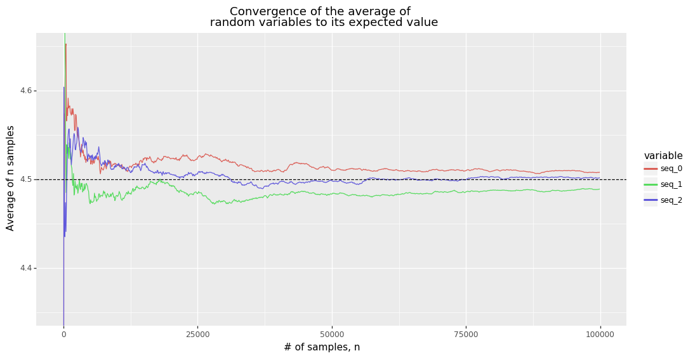
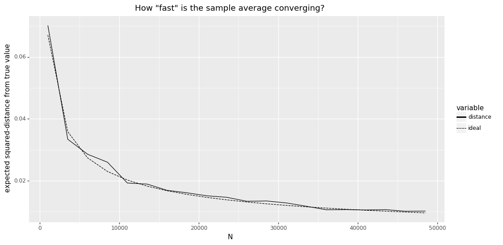
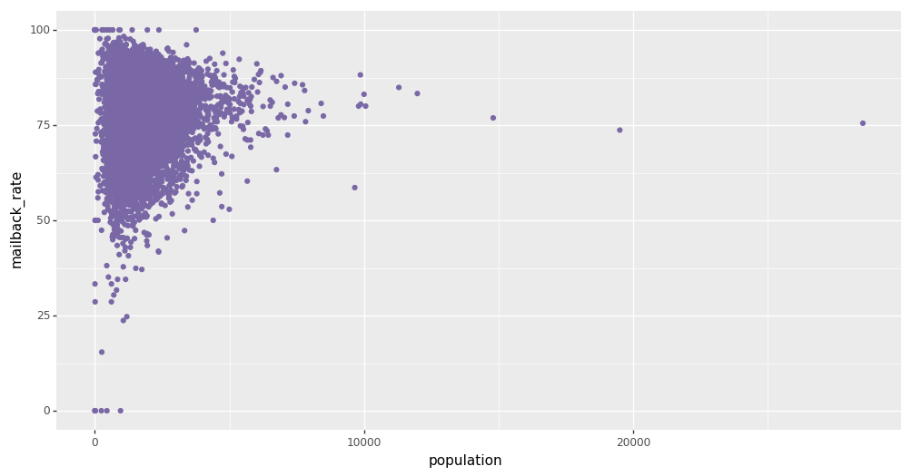

# Chapter 4 the Greatest Theorem Never Told


```python
from plotnine import *
```

```python
%matplotlib inline
import numpy as np
import pandas as pd
from IPython.core.pylabtools import figsize
```

```python
import matplotlib
matplotlib.rc('font', family = 'Apple SD Gothic Neo')
```

## 4.2 큰 수의 법칙

*같은 분포에서 나온 확률변수집합의 평균은 그 분포의 기댓값으로 수렴한다*

### 4.2.2 예제: 푸아송 확률변수의 수렴

$\lambda = 4.5$인 푸아송 확률변수를 표본추출해보자. 이 때, 기대값은 모수 $\lambda$와 동일한다.

n=`1` 부터 `sample_size` 까지 첫 표본 n개의 평균을 계산해보자


```python
sample_size = 100000
expected_value = 4.5
n_samples = range(1, sample_size, 100)

results = {}

for k in range(3):
    samples = np.random.poisson(expected_value, sample_size)
    partial_average = [samples[:i].mean() for i in n_samples]
    
    results['seq_{}'.format(k)] = partial_average
```


```python
poi_expectation = (pd.DataFrame(results)
   .reset_index()
   .pipe(pd.melt, id_vars=['index'], value_vars=['seq_0', 'seq_1', 'seq_2'])
   .assign(index = lambda d: d['index'] * 100)
)

poi_expectation.head()
```


<div>
<style scoped>
    .dataframe tbody tr th:only-of-type {
        vertical-align: middle;
    }

    .dataframe tbody tr th {
        vertical-align: top;
    }

    .dataframe thead th {
        text-align: right;
    }
</style>
<table border="1" class="dataframe">
  <thead>
    <tr style="text-align: right;">
      <th></th>
      <th>index</th>
      <th>variable</th>
      <th>value</th>
    </tr>
  </thead>
  <tbody>
    <tr>
      <th>0</th>
      <td>0</td>
      <td>seq_0</td>
      <td>3.000000</td>
    </tr>
    <tr>
      <th>1</th>
      <td>100</td>
      <td>seq_0</td>
      <td>4.574257</td>
    </tr>
    <tr>
      <th>2</th>
      <td>200</td>
      <td>seq_0</td>
      <td>4.462687</td>
    </tr>
    <tr>
      <th>3</th>
      <td>300</td>
      <td>seq_0</td>
      <td>4.601329</td>
    </tr>
    <tr>
      <th>4</th>
      <td>400</td>
      <td>seq_0</td>
      <td>4.648379</td>
    </tr>
  </tbody>
</table>
</div>


```python
(ggplot(poi_expectation, aes(x='index', y='value', color='variable')) +
  geom_line() +
  geom_hline(aes(yintercept=expected_value), linetype='--') +
  coord_cartesian(ylim=(4.35, 4.65)) +
  ggtitle('Convergence of the average of \n random variables to its \
expected value') +
  xlab('# of samples, n') + ylab('Average of n samples') +
  theme(figure_size=(12, 6)))
```




n이 커지면서 포아송 확률분포의 평균이 수렴하는 것을 확인할 수 있다. 그렇다면 **얼마나 빨리** 기댓값에 수렴할 수 있을까??


```python
N_Y = 250
N_array = np.arange(1000, 50000, 2500)

expected_value = 4.5
```


```python
N_array
```


    array([ 1000,  3500,  6000,  8500, 11000, 13500, 16000, 18500, 21000,
           23500, 26000, 28500, 31000, 33500, 36000, 38500, 41000, 43500,
           46000, 48500])


```python
def D_N(n):
    Z = np.random.poisson(expected_value, (n, N_Y))
    average_Z = Z.mean(axis=0)
    return np.sqrt(((average_Z - expected_value)**2).mean())
```


```python
list_conv_speed = list(map(lambda d: D_N(d), N_array))

pd_conv_speed = (
    pd.DataFrame({'distance': list_conv_speed})
      .reset_index() 
      .assign(index = lambda d: d['index'] * 2500 + 1000,
             ideal = lambda d: np.sqrt(expected_value / d['index']))
      .pipe(pd.melt, id_vars=['index'])
)
```


```python
pd_conv_speed.head()
```


<div>
<style scoped>
    .dataframe tbody tr th:only-of-type {
        vertical-align: middle;
    }

    .dataframe tbody tr th {
        vertical-align: top;
    }

    .dataframe thead th {
        text-align: right;
    }
</style>
<table border="1" class="dataframe">
  <thead>
    <tr style="text-align: right;">
      <th></th>
      <th>index</th>
      <th>variable</th>
      <th>value</th>
    </tr>
  </thead>
  <tbody>
    <tr>
      <th>0</th>
      <td>1000</td>
      <td>distance</td>
      <td>0.070179</td>
    </tr>
    <tr>
      <th>1</th>
      <td>3500</td>
      <td>distance</td>
      <td>0.033419</td>
    </tr>
    <tr>
      <th>2</th>
      <td>6000</td>
      <td>distance</td>
      <td>0.028567</td>
    </tr>
    <tr>
      <th>3</th>
      <td>8500</td>
      <td>distance</td>
      <td>0.026000</td>
    </tr>
    <tr>
      <th>4</th>
      <td>11000</td>
      <td>distance</td>
      <td>0.019276</td>
    </tr>
  </tbody>
</table>
</div>


```python
(ggplot(pd_conv_speed, aes(x='index', y='value', linetype='variable')) +
  geom_line() +
  xlab('N') + ylab('expected squared-distance from true value') +
  ggtitle('How "fast" is the sample average converging?') +
  theme(figure_size=(12, 6))
)
```





대개의 경우 Z와 같은 일련의 확률변수가 주어지면 큰 수의 법칙에서 $E(Z)$로의 수렴률은 다음과 같다

$$\frac{\sqrt{Var(Z)}}{\sqrt{N}}$$

큰 수 N이 주어진 경우 (평균적으로) 우리는 추정치에서 얼마나 떨어져 있는지 안다. 반면, 베이지안 설정에서는 이것이 무용한 결과처럼 보일 수 있다. 베이지안 분석은 불확실성을 다루기에 좋다. 그러면 정밀도를 좀 더 높이려는 통계의 관점에서 베이지안 분석은 어떠한가? 표본을 추출하는 계산에 대한 부담이 없어 더 큰 N값을 다루기에도 좋다.

### 4.2.3 Var(Z) 를 어떻게 계산할까?

일단 큰수의 법칙을 사용해 기댓값을 계산하고 나면 이를 이용해 분산을 추정할 수 있다.

### 4.2.4 기댓값과 확률

지시함수를 정의해보면, 큰 수의 법칙에 따라 표본 $X_i$가 많아질 때 $P(A)$라고 표기한 사건 A의 확률을 추정할 수 있다.

예를 들면 $Z \sim Exp(0.5)$가 10보다 클 확률을 추정하고 싶고, $Exp(0.5)$ 분포에서 표본을 많이 얻었다고 하자.


```python
N = 10000
print( np.mean([np.random.exponential(0.5) > 5 for i in range(N)]) )
```

    0.0001


###  4.2.5 베이지안 통계와 무슨 상관이 있을까?

베이지안 추론의 **점추정**은 기댓값을 사용하여 계산한다. 더 이론적인 베이지안 추론이라면 우리는 다차원 적분으로 나타낸 복잡한 기댓값을 구해야 했을 것이다. 하지만 사후확률분포에서 직접 표본을 얻을 수 있다면 평균을 계산하는 것으로 대신할 수 있다. 정확도가 중요하다면 얼마나 빨리 수렴하는지 그래프를 그려서 보여주면 된다. 더 높은 정확도를 원한다면 사후확률분포에서 표본을 더 뽑아오면 된다.

어느 정도면 충분할까? 언제까지 사후분포에서 표본을 추출해야 할까? 이것은 실무자의 의사결정과 표분의 분산에 따라 다르다. 분산이 클 경우 평균이 천천히 수렴한다.

큰 수의 법칙이 통하지 않는 경우도 있다. 이름을 보면 알 수 있듯이 표본의 수가 많을 때만 법칙이 통한다. 큰 수의 법칙이 실패하는 경우를 알게 되면 우리가 어느 정도 불확실성을 가져야 할지 깨닫게 된다.

## 4.3 작은 수의 혼란

큰 수의 법칙은 N이 무한정 커져 결코 도달할 수 없는 경우에만 유효하다

### 4.3.1 예제: 통합된 지리 데이터

- 데이터셋에 **카운티가 5,000개** 있다고 가정해보자. 
- 그리고 각 카운티의 **인구수는 100 ~ 1,500명 사이에 균등분포**되어 있다. 
- 아직 미지수인 **키는 카운티별로 크게 변하지 않고**, 
- 각 개인은 같은 키 분포를 가지고 있어서 거주하는 **카운티와는 독립**적이다.

이제 각 카운티 사람들의 평균 키를 측정해보자.


```python
std_height = 15
mean_height = 150

n_counties = 5000
population = np.random.randint(100, 1500, n_counties)
average_across_county = [np.random.normal(mean_height, 1/std_height, population[i]).mean() 
                         for i in range(n_counties)]
```


```python
df_height = (
  pd.DataFrame({'height': average_across_county,
                'population': population})
   .assign(is_min = lambda d: d.height == np.min(d.height))
   .assign(is_max = lambda d: d.height == np.max(d.height))
   .assign(minmax = lambda d: d['is_min'] | d['is_max'])
   .loc[:, ['height','population','minmax']]
)

df_height.head()
```


<div>
<style scoped>
    .dataframe tbody tr th:only-of-type {
        vertical-align: middle;
    }

    .dataframe tbody tr th {
        vertical-align: top;
    }

    .dataframe thead th {
        text-align: right;
    }
</style>
<table border="1" class="dataframe">
  <thead>
    <tr style="text-align: right;">
      <th></th>
      <th>height</th>
      <th>population</th>
      <th>minmax</th>
    </tr>
  </thead>
  <tbody>
    <tr>
      <th>0</th>
      <td>150.012247</td>
      <td>150</td>
      <td>False</td>
    </tr>
    <tr>
      <th>1</th>
      <td>149.998245</td>
      <td>271</td>
      <td>False</td>
    </tr>
    <tr>
      <th>2</th>
      <td>149.998684</td>
      <td>1002</td>
      <td>False</td>
    </tr>
    <tr>
      <th>3</th>
      <td>149.993579</td>
      <td>536</td>
      <td>False</td>
    </tr>
    <tr>
      <th>4</th>
      <td>149.998142</td>
      <td>1013</td>
      <td>False</td>
    </tr>
  </tbody>
</table>
</div>


```python
(ggplot(df_height, aes(x='population', y='height', color='minmax', size='minmax')) +
  geom_point() +
  geom_hline(aes(yintercept=mean_height), linetype='--') +
  scale_color_manual(values=['#7A68A6', '#A60628']) +
  scale_size_manual(values=[1.0, 5.0]) +
  ggtitle('Average height VS County Population') +
  xlab('County Population') + ylab('Average height in county') +
  theme(figure_size=(12, 6))
)
```


인구수를 고려하지 않으면 우리는 엄청난 추론 오류를 일으킬 위험이 있다. 만약 인구수를 무시한다면 키가 가장 작은 사람과 가장 큰 사람이 있는 카운티는 그래프 안의 붉은 원에 위치한다고 말할 수 있다. 하지만 이런 추론은 틀렸다. 두 카운티는 반드시 극단의 키를 가졌다고 할 수 없다. 이 오류는 인구수가 작은 카운티의 평균이 인구의 진짜 기댓값($\mu=150$)을 적절히 반영하지 못한 결과다. 표본크기/인구수/N 은 너무 작아서 큰 수의 법칙이 효과적이지 못하다


```python
# 가장 키가 작은 10개의 카운티 인구수
population[ np.argsort(average_across_county)[:10] ]
```


    array([103, 168, 104, 158, 153, 250, 260, 112, 127, 206])


```python
# 가장 키가 큰 10개의 카운티 인구수
population[ np.argsort([-x for x in average_across_county])[:10] ]
```


    array([197, 273, 125, 129, 115, 186, 201, 153, 110, 102])


인구수 100~1500 사이에서 고르게 분포하지 않는다. 이 예제에서 큰 수의 법칙은 완전히 실패했다.

### 4.3.2 예제: 캐글의 미국 인구조사 우편물 회신율 챌린지


```python
url_censusdata = 'https://github.com/CamDavidsonPilon/Probabilistic-Programming-and-Bayesian-Methods-for-Hackers/raw/master/Chapter4_TheGreatestTheoremNeverTold/data/census_data.csv'
data = np.genfromtxt(url_censusdata, skip_header=1, delimiter=",")
```


```python
data
```


    array([[   74.5,   686. ],
           [   85.8,  1112. ],
           [   77.1,  1409. ],
           ..., 
           [   81.1,   821. ],
           [   83.4,  1141. ],
           [   81.4,   569. ]])


```python
census = pd.DataFrame(data, columns=['mailback_rate', 'population'])
census.head()
```


<div>
<style scoped>
    .dataframe tbody tr th:only-of-type {
        vertical-align: middle;
    }

    .dataframe tbody tr th {
        vertical-align: top;
    }

    .dataframe thead th {
        text-align: right;
    }
</style>
<table border="1" class="dataframe">
  <thead>
    <tr style="text-align: right;">
      <th></th>
      <th>mailback_rate</th>
      <th>population</th>
    </tr>
  </thead>
  <tbody>
    <tr>
      <th>0</th>
      <td>74.5</td>
      <td>686.0</td>
    </tr>
    <tr>
      <th>1</th>
      <td>85.8</td>
      <td>1112.0</td>
    </tr>
    <tr>
      <th>2</th>
      <td>77.1</td>
      <td>1409.0</td>
    </tr>
    <tr>
      <th>3</th>
      <td>90.0</td>
      <td>1892.0</td>
    </tr>
    <tr>
      <th>4</th>
      <td>77.9</td>
      <td>1134.0</td>
    </tr>
  </tbody>
</table>
</div>


우편물 회신율 대 블록 그룹 인구수 그래프


```python
(ggplot(census, aes(x='population', y='mailback_rate')) +
 geom_point(color='#7A68A6') +
 theme(figure_size=(12,6))
)
```



위 산포도는 통계학에서 고전적인 현상이다. 삼각형 모양으로 구성되어 있고, 표본 크기를 늘리면 더 뾰족해진다.

큰 데이터셋은 번거로움 없이 큰 수의 법칙을 응용할 수 있는 반면에, 작은 데이터셋은 큰 수의 법칙을 사용하여 처리할 수 없다. 큰 수의 법칙으로 인해, 데이터가 많은 경우 어느 정도 새로운 데이터를 가감해도 큰 영향을 받지 않는 안정적인 솔루션을 만들 수 있다. 반면에 작은 데이터셋에서는 데이터 포인트를 더하거나 제거하는 것이 매우 다른 결과를 불러올 수 있다.
