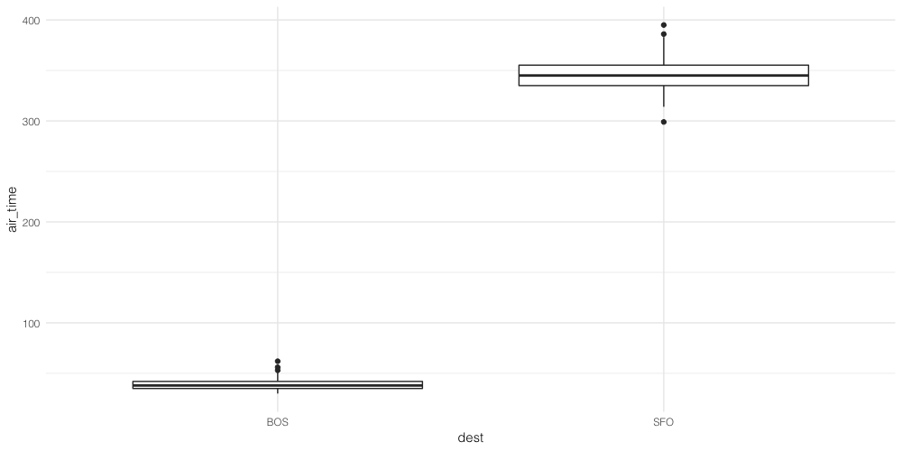

# Ch10. Hypothesis Testing

다음 문서를 간단히 정리한다. <https://moderndive.com/10-hypothesis-testing.html>

## 1. inference가 필요하지 않은 경우

항상 엄밀한 가설검정이 필요한 것은 아니다.
가설과 테스트에 대해 생각하기 전에 탐색적 자료분석(EDA)을 해보는 것이 큰 도움이 된다.

예를 들어 살펴보자. `nycflights13` 라이브러리에 있는 `flights` 데이터에서, 뉴욕에서 출발하여 보스턴 또는 샌프란시스코로 향하는 비행편 정보를 샘플링해보자.

```r
library(tidyverse)
library(infer)
library(nycflights13)

bos_sfo = flights %>%
  filter_all(all_vars(!is.na(.))) %>%
  filter(dest %in% c('BOS', 'SFO')) %>%
  group_by(dest) %>%
  sample_n(100)
```

샌프란시스코를 갈 때 공중에 머무르는 시간이 보스턴에 갈 때보다 통계적으로 더 길다고 볼 수 있을까?
간단한 EDA를 해보자.

```r
bos_sfo %>%
  group_by(dest) %>%
  summarize(mean_time = mean(air_time),
            sd_time = sd(air_time))
# # A tibble: 2 x 3
#   dest  mean_time sd_time
#   <chr>     <dbl>   <dbl>
# 1 BOS        39.2    5.43
# 2 SFO       347.    17.5
```

결과를 보면 SFO의 `air_time`이 `BOS` 에 비해 현저히 긴 것을 볼 수 있다.
특히 표준편차를 알고 있는 것이 큰 도움이 되었다.
Box Plot을 그려서 살펴보자.

```r
ggplot(bos_sfo, aes(x = dest, y = air_time)) +
  geom_boxplot() +
  theme_minimal(base_family = 'Helvetica Light')
```



전혀 겹치는 구간이 없기 때문에, 샌프란시스코로 향할 때의 비행시간이 확실히 더 길다는 결론을 내릴 수 있다.
이러한 경우에는 굳이 EDA 이상의 추론을 할 필요가 없다.

## 2. 가설검정의 기초

가설검정에서는 모수에 대한 두 가지 상반되는 가설 중에 하나를 선택하기 위해 데이터를 사용한다.

- 하나는 H0로 표기하는 귀무가설 (Null Hypothesis)
- 또 하나는 H1으로 표기하는 대립가설 (alternative hypothesis 또는 research hypothesis)

두 가지 가설의 역할이 다르기 때문에 서로 교환할 수 없다.

- 대립가설은 보통 연구자/분석가가 증거를 찾고자 하는 가설을 말한다
- 귀무가설은 *효과가 없다* 또는 *둘 사이에 차이가 없다* 는 가설을 말한다
- 귀무가설이 맞다는 것을 가정한 상태에서 현재 샘플 데이터가 얼마나 나오기 어려운 상황인지 계산한다

모든 가설검정은 Allen Downey가 제시한 [다음 프레임워크](http://allendowney.blogspot.com/2016/06/there-is-still-only-one-test.html) 로
표현할 수 있다.


## 3. 가설검정과 형사 재판 비교하기

가설검정을 형사 재판의 맥락에서 생각해보자.
미국의 형사재판은 두 개의 상반된 주장으로부터 하나를 선택해야 한다는 점에서 가설검정과 비슷한다.

1. 피고인은 판결에 따라 유죄 또는 무죄가 결정된다
2. 사법체계에 따라, 기본적으로는 무죄인 것으로 간주한다
3. 뚜렷한 증거가 있어야 무죄라는 주장을 뒤집고 유죄판결을 내릴 수 있다
4. *beyond a reasonable doubt* 라는 문구는 유죄 판결을 내리기 충분할 정도로 증거가 모였을 때, 판단 기준으로 종종 사용된다

이론적으로는 *이 사람은 무죄다* 라고 하지 않는다. 대신 *유죄라고 할만한 충분한 근거가 부족하다* 고 한다.

이제 가설검정과 비교해보자.

1. 모집단의 파라미터를 결정하는 것은 두 가설 중 하나를 선택하는 방식으로 진행된다
2. 기본적으로는 귀무가설이 참이라고 가정한다
3. 귀무가설이 거짓이라는 강력한 증거가 발견될 때 귀무가설을 기각할 수 있다
4. 유의수준(Significance Level, alpha)을 기준으로 판단한다

### 3.1 가능한 두 가지 결론

따라서 가설검정은 두 가지 결론을 낼 수 있다.

- 귀무가설을 기각한다
- 귀무가설을 기각하지 않는다

직관적으로 귀무가설을 기각하지 못했다는 것은 귀무가설이 맞다는 것으로 이해할 수 있지만, 기술적으로는 전혀 다르다.
귀무가설이 맞다는 것은 피고인이 무죄라는 것을 의미한다. 하지만 우리는 무죄라는 것을 증명할 수 없다.
다만 우리는 유죄라는 것을 입증하기 위한 충분한 증거를 찾지 못했을 뿐이다.

따라서, 가설검정 결과에 *"귀무가설이 참이다"* 라고 말하지 말자. 대신 *"귀무가설을 기각하지 못한다"* 라고 한다.

## 4. 가설검정에서 발생할 수 있는 에러의 종류

형사재판에서 발생할 수 있는 잘못된 판결은 다음과 같은 종류가 있다.

- 무고한 사람에게 유죄 판결을 내린다
- 유죄 판결을 받았어야 하는 사람이 풀려난다

가설검정에서는 다음과 같은 상황이 벌어질 수 있다.

- 귀무가설이 맞는데 귀무가설을 기각한다 (Type 1 Error)
- 귀무가설이 틀렸는데 귀무가설을 기각하지 못한다 (Type 2 Error)

전체 모수를 일부 샘플을 바탕으로 추론하기 위해서는 에러를 감수할 수 밖에 없다.
샘플을 기반으로 한 모든 테스트는 에러가 발생할 가능성이 존재한다.
어쨌든 우리는 에러를 최소화시켜야 한다.

- `Type 1 Error` : `alpha`, 귀무가설이 맞을 때 귀무가설을 기각할 확률
- `Type 2 Error` : `beta`, 귀무가설이 틀렸을 때 귀무가설을 기각할 확률

이상적으로는 `alpha = 0`, `beta = 0` 인 것이 가장 좋을 것이다.
하지만 샘플링된 데이터라면 정보가 완전하지 않기 때문에 불가능하다.
일반적으로는 가설검정을 수행하기 전에 alpha 값을 고정시킨다. 그리고 증거와 alpha 값을 비교한다.
alpha 값으로는 보통 0.05, 0.01, 0.1 등을 사용한다.

alpha 값이 작아진다는 것은 귀무가설을 기각하기 위해 더 확실한 증거가 필요하다는 것을 의미한다.
따라서 alpha가 너무 작아지면 귀무가설이 거의 기각되지 않는다. 따라서 Type 2 Error가 증가한다!
다시 말해 alpha가 작아지면 beta가 증가하고, alpha가 커지면 beta가 감소한다.
결국 두 값 사이의 균형이 중요하다. 
